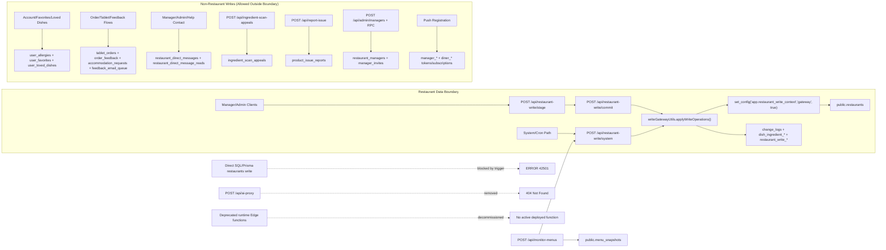

# Database and Data Update Pathways Review (Post-Cutover, 2026-02-17)

## Scope

Reviewed active runtime mutation paths in:

- `app/` (Next.js API + client write callers)
- `supabase/migrations/` (DB-level write controls)
- `scripts/` (operational write scripts)

Explicitly excluded:

- `archive/` (historical snapshots only)

## Executive Outcome

The restaurant write boundary is now explicitly centralized:

- Allowed restaurant mutations: `POST /api/restaurant-write/stage`, `POST /api/restaurant-write/commit`, `POST /api/restaurant-write/discard`, and internal `POST /api/restaurant-write/system`.
- Internal monitoring updates now use `MONITORING_STATS_UPDATE` through gateway logic.
- Generic runtime function proxy was removed (`/api/ai-proxy` deleted).
- Legacy direct edge insert bypass was removed (`supabase/functions/api/index.ts` deleted).
- Missing `report-issue` runtime source gap is closed (`/api/report-issue` added).
- Dead tablet bootstrap runtime dependency removed (`app/lib/tabletOrdersApi.js` deleted).

## Enforcement Controls

### 1) Gateway-only restaurant writes in application code

- Shared gateway operation enum now includes:
  - `RESTAURANT_WRITE_OPERATION_TYPES.MONITORING_STATS_UPDATE`
- System-only operation class added for monitoring updates.
- Write-version bumps remain limited to manager/admin content operations.
- `MONITORING_STATS_UPDATE` intentionally does not increment `write_version`.

Primary file:

- `app/api/restaurant-write/_shared/writeGatewayUtils.js`

### 2) Transaction-scoped DB context contract

Gateway transactions now set write context before restaurant DML:

- `set_config('app.restaurant_write_context', 'gateway', true)`

Applied in:

- `applyWriteOperations(...)`
- `bumpRestaurantWriteVersion(...)`

Primary file:

- `app/api/restaurant-write/_shared/writeGatewayUtils.js`

### 3) Internal system write entrypoint

Added internal route for non-user restaurant writes:

- `POST /api/restaurant-write/system`
- Required header: `x-clarivore-system-key`
- Required env: `CLARIVORE_SYSTEM_WRITE_KEY`
- Allowed operation type: `MONITORING_STATS_UPDATE` only

Primary file:

- `app/api/restaurant-write/system/route.js`

### 4) DB trigger enforcement migration

Added migration:

- `supabase/migrations/20260222100000_enforce_restaurant_gateway_context.sql`

Behavior:

- Trigger on `public.restaurants` for `INSERT/UPDATE/DELETE`
- Rejects write unless `current_setting('app.restaurant_write_context', true) = 'gateway'`

Status:

- Applied in target environment (`fgoiyycctnwnghrvsilt`) on 2026-02-17.
- Trigger/function are active and direct `public.restaurants` writes without gateway context now fail with the expected `42501` error.

### 5) Monitoring flow moved to Next + gateway

Added route:

- `POST /api/monitor-menus`

Behavior:

- Writes menu snapshots directly to `menu_snapshots`
- Routes all `restaurants.last_checked`, `restaurants.total_checks`, `restaurants.emails_sent` writes through gateway system operation
- Vercel cron added in `vercel.json` to call `/api/monitor-menus`

Additional migration:

- `supabase/migrations/20260222101000_unschedule_edge_monitoring_cron.sql`

## API Surface Changes

Removed endpoint:

- `POST /api/ai-proxy`

Added/now-explicit endpoints:

- `POST /api/report-issue`
- `POST /api/help-assistant`
- `POST /api/ai-dish-search`
- `POST /api/admin/managers`
- `POST /api/notifications/manager-chat`
- `POST /api/notifications/diner-notice`
- `POST /api/notifications/email`
- `POST /api/detect-menu-dishes`
- `POST /api/detect-corners`
- `POST /api/analyze-ingredient-scan`
- `POST /api/restaurant-write/system` (internal)
- `POST /api/monitor-menus` (internal/cron)

## Runtime Edge Decommission Status

Decommission commands were run against project `fgoiyycctnwnghrvsilt` on 2026-02-17 for:

- `api`
- `detect-menu-dishes`
- `detect-corners`
- `analyze-ingredient-scan`
- `send-notification-email`
- `help-assistant`
- `ai-dish-search`
- `admin-managers`
- `notify-manager-chat`
- `notify-diner-notice`
- `monitor-menus`
- `report-issue`
- `tablet-orders-bootstrap`

Result:

- Runtime traffic for these paths is now expected only through Next.js API routes.

## Post-Cutover Write Pathway Matrix

### Restaurant-boundary mutations (strict boundary)

| Entry | Route/API | Auth boundary | Writes |
|---|---|---|---|
| Manager/admin editor updates | `/api/restaurant-write/stage` + `/api/restaurant-write/commit` | manager/admin session + scope auth | `restaurant_write_batches`, `restaurant_write_ops`, then `restaurants`, `change_logs`, `dish_ingredient_*` |
| Admin create/delete restaurant | same gateway routes | admin only | `restaurants` via gateway ops `RESTAURANT_CREATE`/`RESTAURANT_DELETE` |
| System monitoring counters | `/api/restaurant-write/system` | `x-clarivore-system-key` | `restaurants.last_checked/total_checks/emails_sent` via `MONITORING_STATS_UPDATE` |
| Menu monitor workflow | `/api/monitor-menus` | cron/system secret | `menu_snapshots` insert + gateway-based restaurant monitoring stat updates |

### Non-restaurant mutation paths (outside boundary by design)

| Entry | Path | Writes |
|---|---|---|
| Account preferences | `app/account/accountService.js`, `app/account/AccountClient.js` | `user_allergies` upsert/delete |
| Restaurant favorites | `app/restaurants/RestaurantsClient.js`, `app/favorites/FavoritesClient.js` | `user_favorites` upsert/delete |
| Loved dishes | `app/restaurant/RestaurantClient.js`, `app/my-dishes/MyDishesClient.js` | `user_loved_dishes` upsert/delete |
| Tablet order lifecycle | `app/restaurant/hooks/useOrderFlow.js`, `app/lib/tabletOrderPersistence.js`, tablet UIs | `tablet_orders` upsert |
| Order feedback flow | `app/order-feedback/OrderFeedbackClient.js` | `order_feedback` insert, `accommodation_requests` insert, `feedback_email_queue` update |
| Manager/admin/help chat | dashboard/help clients | `restaurant_direct_messages` insert, `restaurant_direct_message_reads` upsert |
| Ingredient scan appeal submit | `/api/ingredient-scan-appeals` | `ingredient_scan_appeals` insert/delete + storage object write/remove |
| Appeal review/admin ops | admin dashboard | `ingredient_scan_appeals` update, optional `restaurant_direct_messages` insert |
| Issue report intake | `/api/report-issue` | `product_issue_reports` insert |
| Product report resolution | admin dashboard | `product_issue_reports` update |
| Manager invite and access | RPCs + `/api/admin/managers` | `manager_invites` via RPC, `restaurant_managers` insert/delete |
| Push registration | `app/lib/managerNotifications.js`, `app/lib/dinerNotifications.js` | `manager_*` / `diner_*` push token & subscription upserts |
| Help KB maintenance | `scripts/build-and-push-help-kb.mjs` | `help_kb` delete/upsert |

## Public Table Coverage (Current Write Posture)

| Table | Current write posture |
|---|---|
| `accommodation_requests` | Active runtime writes |
| `allergen_detection_issues` | No active runtime writer found in current app paths |
| `app_admins` | Restricted/admin provisioning path |
| `allergens` | Seed/migration writes only |
| `anonymous_feedback` | Active runtime writes |
| `change_logs` | Gateway-only writes |
| `diet_allergen_conflicts` | Seed/migration writes only |
| `diets` | Seed/migration writes only |
| `diner_device_tokens` | Active runtime writes |
| `diner_push_subscriptions` | Active runtime writes |
| `dish_interactions` | No active runtime writer found in current app paths |
| `editor_locks` | No active runtime writer found in current app paths |
| `feedback_email_queue` | Active runtime writes |
| `help_kb` | Operator/script writes |
| `ingredient_scan_appeals` | Active runtime writes |
| `issue_reports` | No active runtime writer found in current app paths |
| `manager_device_tokens` | Active runtime writes |
| `manager_invitations` | Legacy table; no active primary runtime writer |
| `manager_invites` | Active runtime writes (RPC) |
| `manager_push_subscriptions` | Active runtime writes |
| `manager_restaurant_access` | Legacy/limited path |
| `menu_snapshots` | Active runtime writes (`/api/monitor-menus`) |
| `order_feedback` | Active runtime writes |
| `product_issue_reports` | Active runtime writes |
| `restaurant_direct_message_reads` | Active runtime writes |
| `restaurant_direct_messages` | Active runtime writes |
| `restaurant_managers` | Active runtime writes |
| `restaurant_write_batches` | Active gateway writes |
| `restaurant_write_ops` | Active gateway writes |
| `restaurants` | Gateway-only intended; DB trigger enforcement activates with migration apply |
| `tablet_orders` | Active runtime writes |
| `user_allergies` | Active runtime writes |
| `user_favorites` | Active runtime writes |
| `user_loved_dishes` | Active runtime writes |
| `dish_ingredient_allergens` | Gateway + backfill script writes |
| `dish_ingredient_diets` | Gateway + backfill script writes |
| `dish_ingredient_rows` | Gateway + backfill script writes |

## End-to-End Flow Chart (Post-Cutover)

## Verification Snapshot

- `npm run build`: passed.
- Runtime policy scans:
  - No `supabase.functions.invoke(` usage in `app/`.
  - No `/functions/v1/` runtime app calls in `app/`.
  - No non-gateway `restaurants` write codepaths in runtime app paths.
- `npm run verify:next-transition`: requires QA env vars; run blocks until env set.

## Remaining Release-Gate Checklist

1. Run `npm run verify:next-transition` in QA with full required env vars.
2. Smoke test:
   - `/api/ai-proxy` returns `404`.
   - Manager/admin restaurant edits succeed through stage/commit.
   - Monitoring stat updates succeed through `/api/monitor-menus` + `/api/restaurant-write/system` and do not bump `write_version`.
