# Clarivore Manager Runbook and User Guide

This document is the operational reference for restaurant managers using Clarivore.

## Scope and Audience

Use this guide if you are responsible for:

- Monitoring and responding to direct manager/admin communication
- Triage of accommodation requests
- Monthly menu confirmation workflow completion
- Brand item updates and replacement actions
- Ongoing analytics review and escalation of blockers

This guide is written as a runbook: each section includes entry conditions, exact actions, expected outcomes, and failure handling.

## Navigation Map

- Access and onboarding flow
- Daily manager workflow
- Direct messages and communication flow
- Accommodation request triage and lifecycle
- Monthly confirmation flow
- Brand replacement flow
- Notification and reminder behavior
- Troubleshooting and escalation

## Core Concepts

- `Manager mode`: editor-capable context (`/manager-dashboard`)
- `Customer mode`: consumer browsing context (`/home`)
- `Pending request`: unresolved accommodation request
- `Implemented`: request addressed with a concrete menu/process change
- `Reviewed`: request assessed but not fully implemented
- `Declined`: request cannot be supported
- `Confirmation due`: monthly confirmation SLA countdown based on `last_confirmed`

## Quick Start

1. Open `/account` and sign in.
2. If invited, use your invite link (for example `/account?invite=<token>`).
3. Confirm you land on `/manager-dashboard`.
4. If you have manager access, use the topbar mode toggle:
5. `Manager` mode opens `/manager-dashboard`.
6. `Customer` mode opens `/home`.

## Flow 1: Access and Onboarding

### Objective

Authenticate the user, apply any invite access, and load an authorized dashboard context.

### Entry Conditions

- User opens Clarivore without guaranteed manager session.
- Invite token may or may not be present.

### Exit Conditions

- Manager dashboard loads with restaurant access, or
- explicit access-state guidance is displayed.

### Access Sequence Diagram

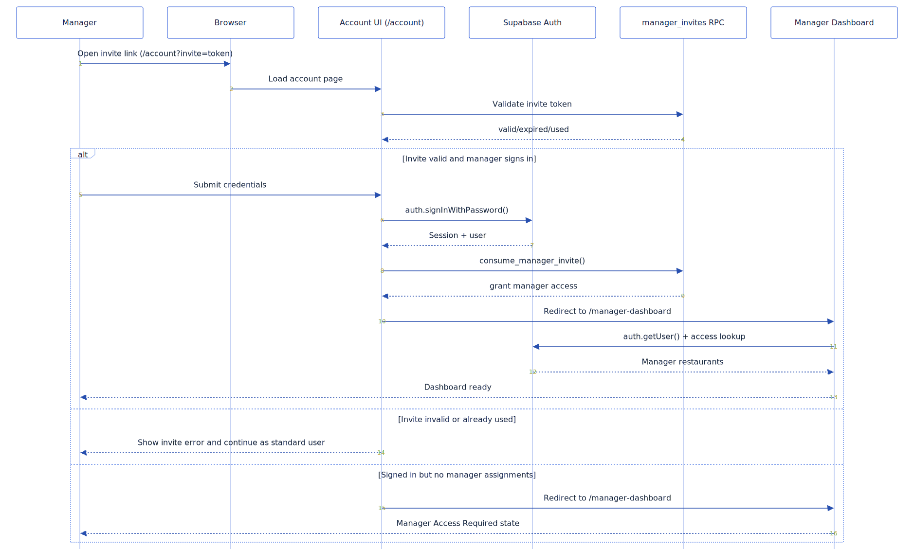

### Access Decision Diagram


### Baseline UI Screenshots

Desktop sign-in:

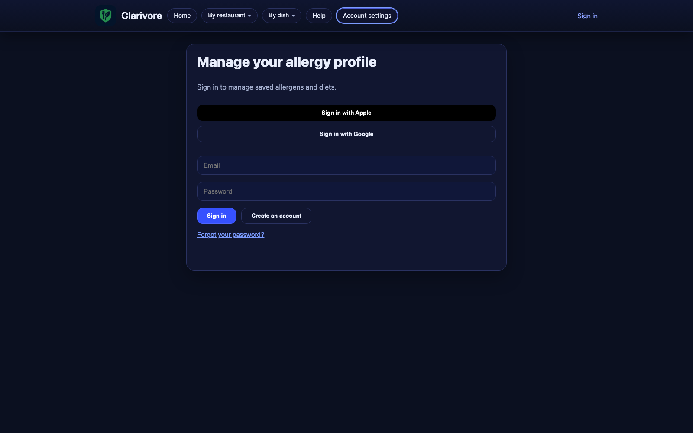

Desktop unauthorized dashboard state:

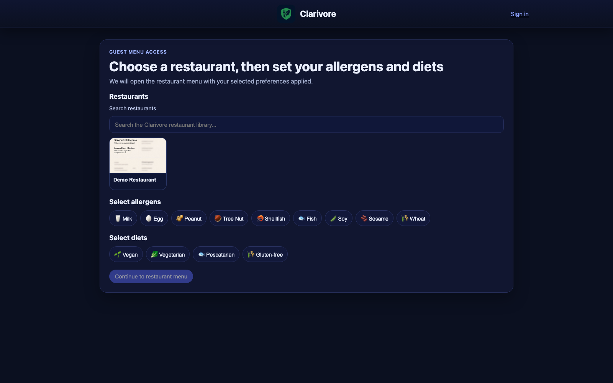

Mobile sign-in:

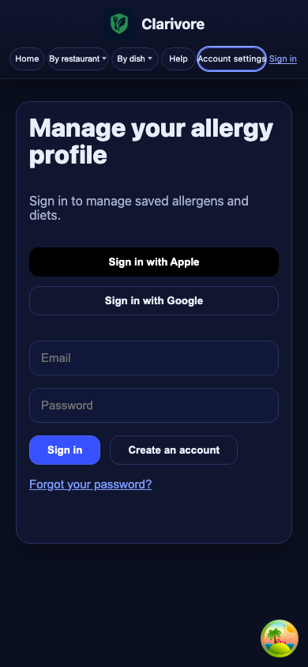

Mobile unauthorized dashboard state:

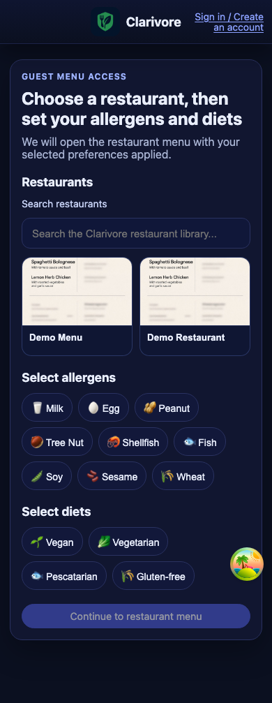

### Operational Notes

- Owners are treated as manager-capable and can access all restaurants.
- Non-owner managers must have assignment rows for one or more restaurants.
- If assignment is missing, dashboard correctly shows `Manager Access Required`.

### Failure Handling

- Invalid/used/expired invite: proceed with standard account path and request new invite.
- Signed in but no manager access: escalate assignment request to admin.

## Flow 2: Daily Manager Workflow

### Objective

Run the full daily dashboard loop in a consistent sequence so communication, requests, and confirmation status do not drift.

### Entry Conditions

- Manager dashboard loads successfully.

### Exit Conditions

- Messages acknowledged or responded to
- pending requests triaged
- confirmation status reviewed
- blockers escalated

### Daily Swimlane Diagram


### Daily Execution Checklist

1. Open `/manager-dashboard`.
2. Validate selected restaurant (owners should verify selector value).
3. Open `Direct Messages`.
4. Acknowledge unread admin/system messages.
5. Triage requests in `Accommodation Requests`.
6. Check due/overdue state in `Menu Confirmation`.
7. Review `Recent changes` and `Brand items in use`.
8. Review heatmap and dietary profile for trend shifts.
9. Escalate blockers with specific evidence.

### Recommended Cadence

- Minimum: once per day
- High-volume restaurants: start/end of shift
- Near due date (<= 7 days): include confirmation readiness check every day

## Flow 3: Direct Messages (Manager/Admin Communication)

### Objective

Maintain an auditable, low-latency communication thread with admin/operations.

### Message Sequence Diagram

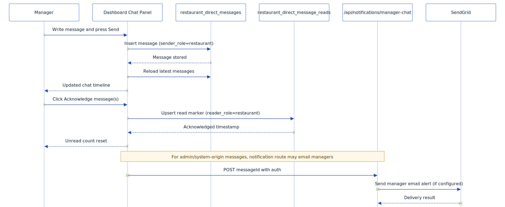

### Panel Behavior Reference

- `Send`: inserts a `restaurant` sender-role message for current restaurant context.
- `Acknowledge message(s)`: writes read marker and clears unread count.
- Timeline shows sender + timestamp and acknowledgment markers.
- Chat list auto-scrolls to latest message after reload.

### Communication SOP

1. For action-required admin messages, acknowledge only after review.
2. Reply with concise update format:
3. `Issue` -> `Impact` -> `Action Taken` -> `Need from Admin`.
4. Keep one thread per restaurant context to avoid cross-store confusion.

### Quality Standard

Good message:

- “Menu page 2 changed at 14:10, gluten-free pasta ingredient replaced, reconfirming rows now, need confirmation on allergen mapping for X brand.”

Weak message:

- “Need help please.”

## Flow 4: Accommodation Request Triage

### Objective

Process every pending accommodation request with explicit status and response context.

### Triage Sequence Diagram

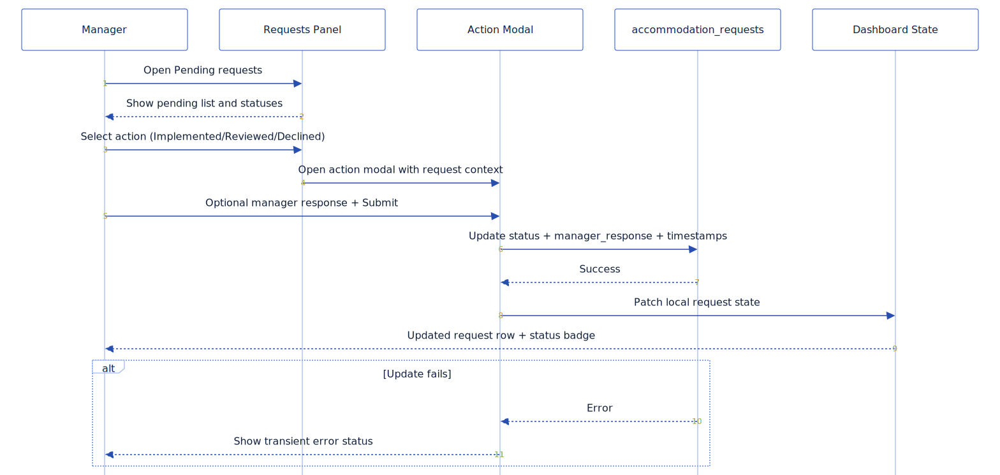

### Request Lifecycle Diagram


### Request Panel Reference

- Tabs:
- `Pending`: unresolved only
- `All`: complete historical list
- Request card details include:
- dish name
- date
- allergen and diet needs
- current status
- manager response (if present)

### Status Decision Rules

- `implemented`: use when accommodation is now materially available.
- `reviewed`: use when analyzed but not yet implemented.
- `declined`: use when request cannot be supported.

### Triage SOP

1. Work from `Pending` tab.
2. Open request action modal for one of three actions.
3. Add optional response text to preserve rationale.
4. Submit and verify status badge update.
5. Spot-check in `All` tab for audit trail completeness.

### Error Handling

If update fails:

1. Retry once.
2. Verify selected restaurant has not changed.
3. Capture request id/dish/status target and escalate if repeated.

## Flow 5: Monthly Confirmation

### Objective

Confirm menu and brand information is current before due date to avoid suspension risk.

### Confirmation Gating Diagram


### Confirmation Commit Sequence

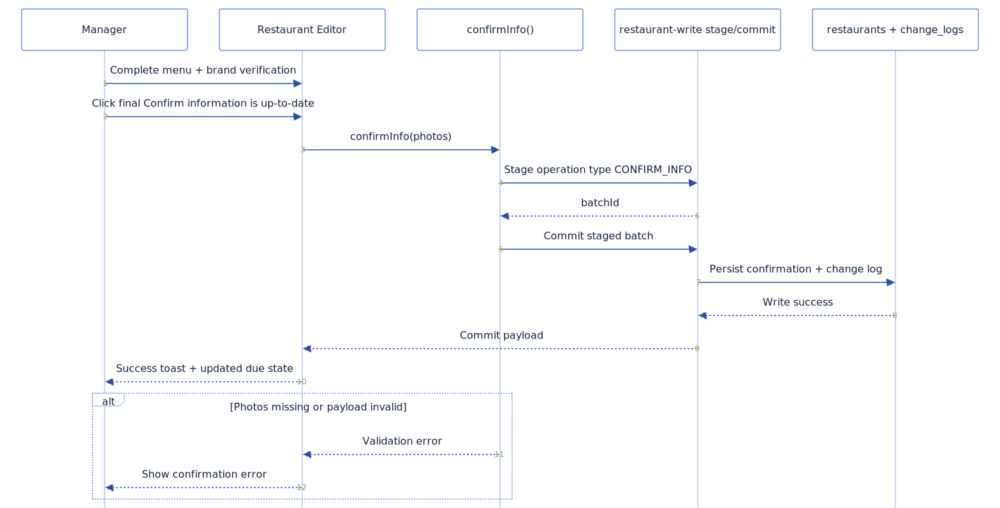

### Due-State Interpretation

- `Due in N days`: healthy if N > 7, caution if N <= 7
- `Due today`: treat as immediate action item
- `X days overdue`: highest priority

### Step 1: Menu Verification

1. Provide a current image or replacement for each saved menu page.
2. Mark pages removed when no longer current.
3. Set both attestations to `Yes`.
4. Wait for comparison outcomes to resolve.
5. Continue only when all pages are matched/replaced and no comparison is pending.

### Step 2: Brand Verification

1. Review each brand card.
2. Replace/capture for mismatched items.
3. Confirm final action only when all brand items are matched.

### Final Submit Outcome

- Confirmation event is written through write gateway flow.
- Due state updates based on new `last_confirmed` timestamp.

### Common Blocks

- Missing page photos
- Attestations unanswered or answered `No`
- Comparison still pending
- Brand mismatch unresolved

## Flow 6: Brand Replacement Workflow

### Objective

Replace a product/brand across affected ingredient rows safely before publishing.

### Brand Replacement Process Diagram


### Brand Replacement Sequence Diagram

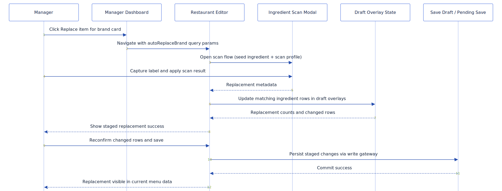

### Execution SOP

1. In `Brand items in use`, locate target brand card.
2. Click `Replace item`.
3. System deep-links to editor with replacement context.
4. Capture/scan replacement label.
5. Review staged row updates in editor.
6. Reconfirm all affected ingredient rows.
7. Save to site.

### Critical Guardrail

Replacement actions are staged in draft overlays and are not live until saved.

### Validation Checklist Before Save

- Target rows updated count is non-zero
- No unresolved ingredient confirmation flags
- Dish context matches intended restaurant/menu

## Analytics Interpretation Guidance

### Menu Interest Heatmap Metrics

- `Total views`: top funnel demand
- `Total loves`: user preference intent
- `Total orders`: conversion signal
- `Total requests`: accommodation friction indicator
- `% accommodated`: compatibility/fit ratio

### Operator Usage Pattern

1. Start with `views` and `orders` to find high-impact dishes.
2. Switch to `requests` and `% accommodated` to detect friction hotspots.
3. Open dish analytics for candidates with high demand and low accommodation fit.
4. Prioritize adjustments that reduce repeated request burden.

### User Dietary Profile Section

- Shows aggregate allergen/diet distribution among interacting users.
- Use to rank accommodation investment by expected user impact.

## Notifications and Reminder Behavior

### Delivery Sequence Diagram

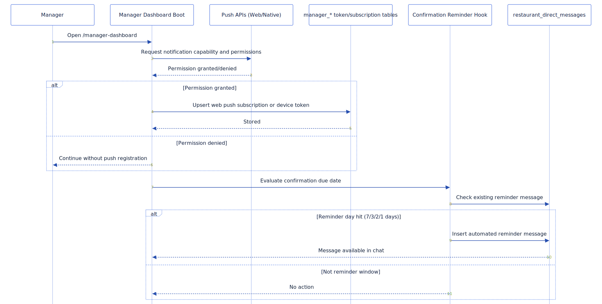

### Behavior Summary

- Manager dashboard boot attempts web/native notification registration.
- Web push permission is user-interaction-gated.
- Reminder messages are eligible at 7, 3, 2, and 1 days before due date.
- Duplicate reminder prevention is built into reminder checks.

### Practical Expectations

- Notifications can be partially available depending on permission and env configuration.
- In-app chat remains primary source of truth for reminder visibility.

## Troubleshooting and Escalation

### Troubleshooting Routing Diagram


### Symptom-to-Action Matrix

| Symptom | Likely Cause | Immediate Action |
| --- | --- | --- |
| `Sign in Required` | No active session | Sign in at `/account` |
| `Manager Access Required` | No manager assignment | Request assignment or reapply invite |
| Dashboard load error | Data fetch/runtime failure | Refresh, retry network, capture timestamp |
| Request update fails | Write/update issue | Retry once, confirm restaurant, escalate with request details |
| Brand replacement appears missing | Draft staged but unsaved | Reconfirm rows and save to site |
| No notifications | Permission/config mismatch | Check permissions, account, and test chat refresh |

### Escalation Template

When escalating to admin, include:

- Restaurant name
- Full page URL
- Action attempted
- Error text shown
- Approximate timestamp
- Screenshot or screen recording if available

## Weekly and Monthly Governance Checklist

### Weekly

1. Pending requests <= operational target.
2. Unread direct messages at zero by close.
3. Top demand dishes reviewed for accommodation gaps.
4. Brand item list reviewed for stale/replaced products.

### Monthly

1. Confirmation completed before due date.
2. Changelog reviewed for risky edits.
3. Escalation backlog cleared.
4. Recurring friction dishes prioritized for remediation.

## Diagram Source and Rebuild

Diagram assets for this guide are generated from Mermaid sources under:

- `docs/manager-flows/src/*.mmd`

Rebuild commands:

- `npm run docs:flows:render`
- `npm run docs:flows:optimize`
- `npm run docs:flows:build`

Optional screenshot capture command:

- `npm run docs:flows:capture`

Optional PDF export:

- `npm run docs:manager:pdf`
