# Clarivore Manager User Guide

This is the manager-facing operating manual for Clarivore. It is organized by manager task type so you can quickly find what to do, where to do it, and what "good" looks like.

## Guide metadata

- Product area: Manager dashboard, webpage editor, viewer validation, tablet pages
- Audience: Restaurant managers, owners, operations leads
- Scope: Day-to-day operation, monthly compliance confirmation, menu maintenance, analytics interpretation, escalation

## How to use this guide

1. Start with `Task map` to understand daily/weekly/monthly responsibility.
2. Jump to the section matching your current task.
3. Use the embedded annotated screenshots and callout mappings while you execute.
4. Use troubleshooting and escalation templates when expected outcomes do not occur.

## Task map



This map is the reference hierarchy for all manager tasks in this guide:

1. Daily operations: communication, request triage, due-date checks, analytics monitoring.
2. Weekly governance: change quality review, brand drift review, viewer spot checks.
3. Monthly governance: two-step confirmation completion and remediation planning.

## Task type 1: Access, onboarding, and navigation

### 1.1 Objective

Access manager tooling in an authorized state and verify that navigation is routing to the correct manager surfaces.

### 1.2 Flow diagrams

### 1.3 Sign-in screen reference

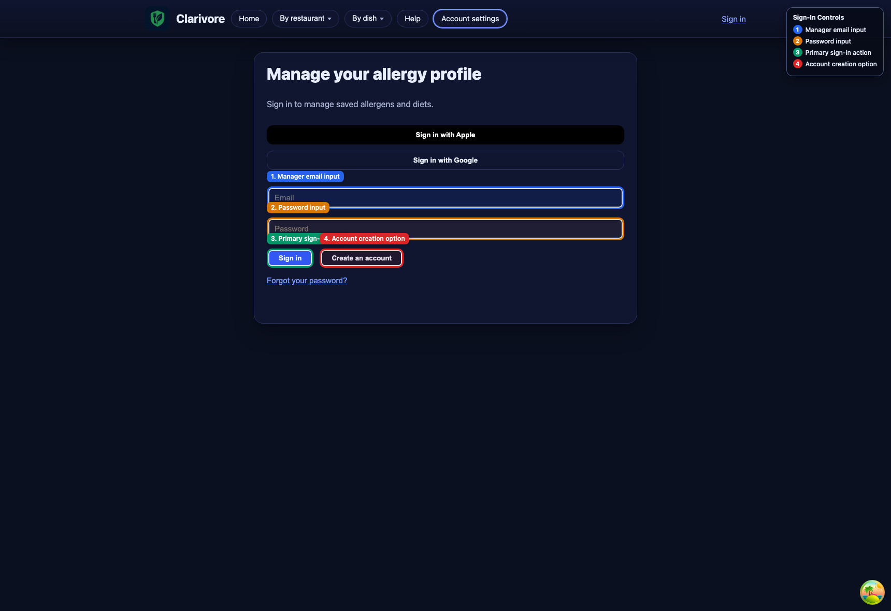

Callout mapping:

1. Manager email input.
2. Password input.
3. Primary sign-in action.
4. Account creation path.

### 1.4 Unauthorized manager-dashboard state reference

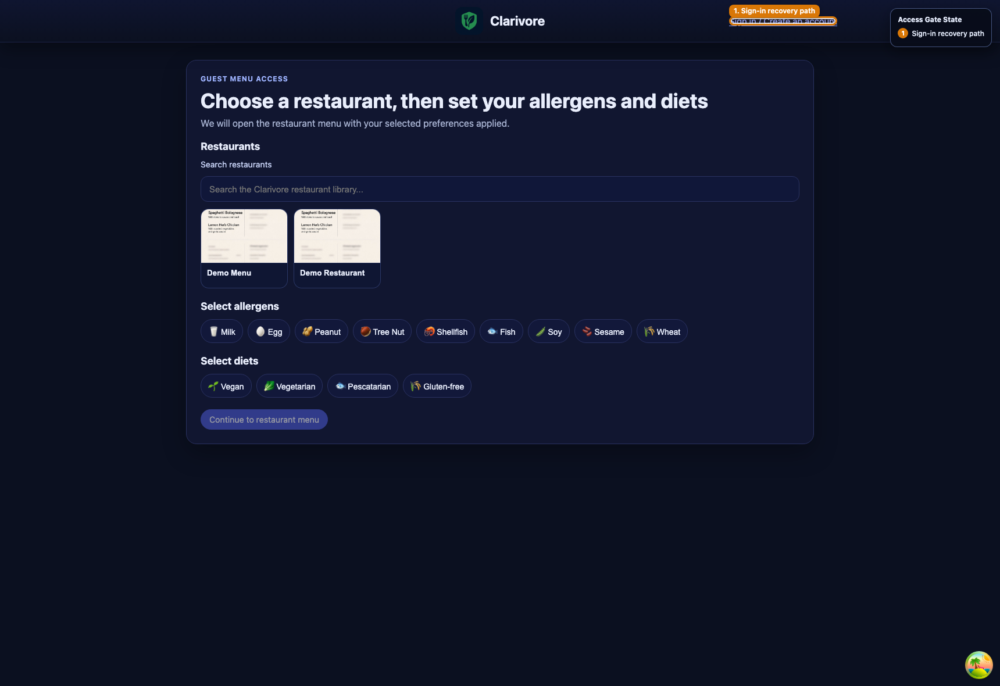

Callout mapping:

1. Authentication-required state.
2. Recovery path to sign-in.

### 1.5 Mobile reference (signin and dashboard shell)

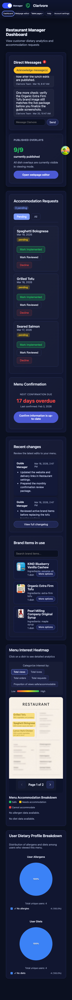

### 1.6 Access checklist

1. Open `/account?mode=signin`.
2. Sign in with manager credentials.
3. Open `/manager-dashboard`.
4. Confirm `Restaurant Manager Dashboard` heading appears.
5. Confirm manager sections render (direct messages, requests, confirmation, changes/brands, analytics).
6. If owner: confirm restaurant selector appears and can switch restaurants.

### 1.7 Common access outcomes

- Signed in but no manager assignment: `Manager Access Required` state appears.
- Signed out: auth-required messaging appears.
- Valid manager assignment: full dashboard content appears.

## Task type 2: Run the manager dashboard command center

### 2.1 Objective

Use dashboard panels as the primary daily control center for communication, triage, compliance, change review, and analytics.

### 2.2 Flow diagrams

### 2.3 Dashboard overview reference

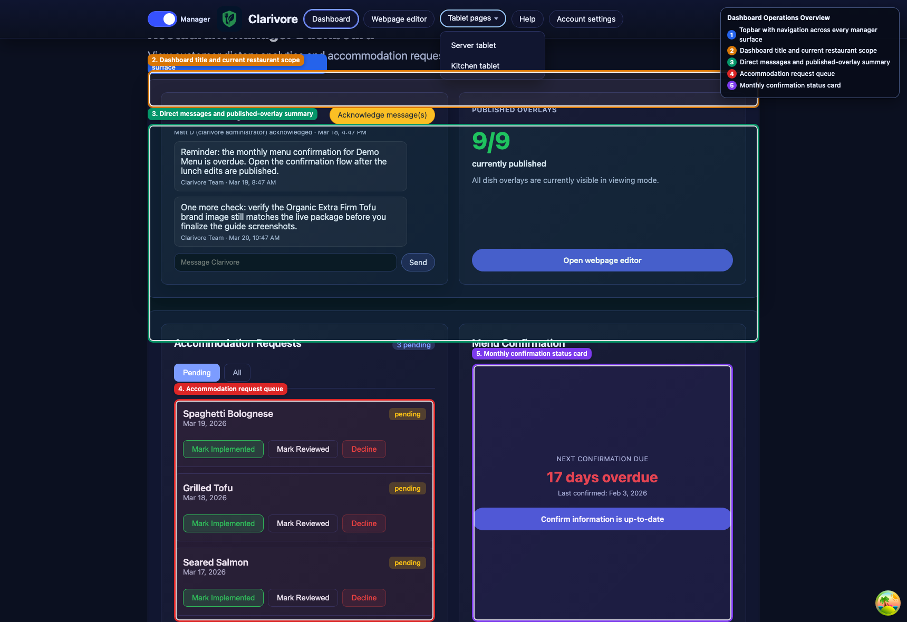

Callout mapping:

1. Topbar with mode toggle and navigation.
2. Dashboard title and scope.
3. Direct message panel.
4. Accommodation request queue.
5. Monthly confirmation status card.

### 2.4 Direct message workflow

#### Flow diagram

#### Execution steps

1. Open `Direct Messages` in dashboard top section.
2. Review unread items and required action context.
3. Reply with structured update: `Issue -> Impact -> Action taken -> Ask from admin`.
4. Use `Acknowledge` after you have processed the message.
5. Confirm unread state drops and timeline shows your response.

#### Quality standard

- Good: actionable details with timestamp, dish/menu scope, and required support.
- Poor: vague requests with no operational context.

### 2.5 Accommodation request triage

#### Flow diagrams

#### Panel reference

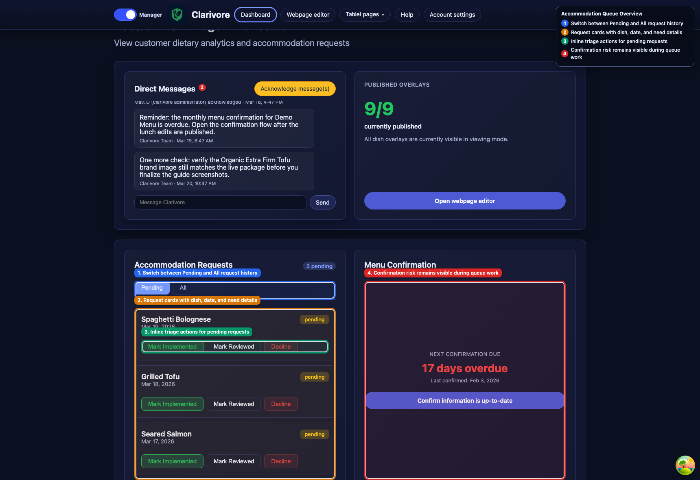

Callout mapping:

1. Pending vs All filters.
2. Request cards and status badges.
3. Implement/Review/Decline actions.
4. Confirmation due-state context alongside triage.

#### Decision rules

- `implemented`: use when accommodation is now materially available.
- `reviewed`: use when assessed but not yet implemented.
- `declined`: use when request cannot be supported.

#### Execution steps

1. Start with `Pending`.
2. Open each request card and verify dish and need context.
3. Apply the correct action (`Mark Implemented`, `Mark Reviewed`, or `Decline`).
4. Add manager response text when rationale is not obvious.
5. Validate state transitions in `All` tab for audit continuity.

### 2.6 Monthly confirmation from dashboard

#### Flow diagrams

#### Dashboard interpretation

- `Due in N days`: normal if `N > 7`, watchlist if `N <= 7`.
- `Due today`: immediate task.
- `X days overdue`: highest urgency.

#### Execution steps

1. Review the `Menu Confirmation` card each day.
2. If due/overdue or verification incomplete, click `Confirm information is up-to-date`.
3. Complete the editor-based confirmation sequence (detailed in task type 3.7).

### 2.7 Review recent changes and brand items

#### Flow diagrams

#### Panel reference

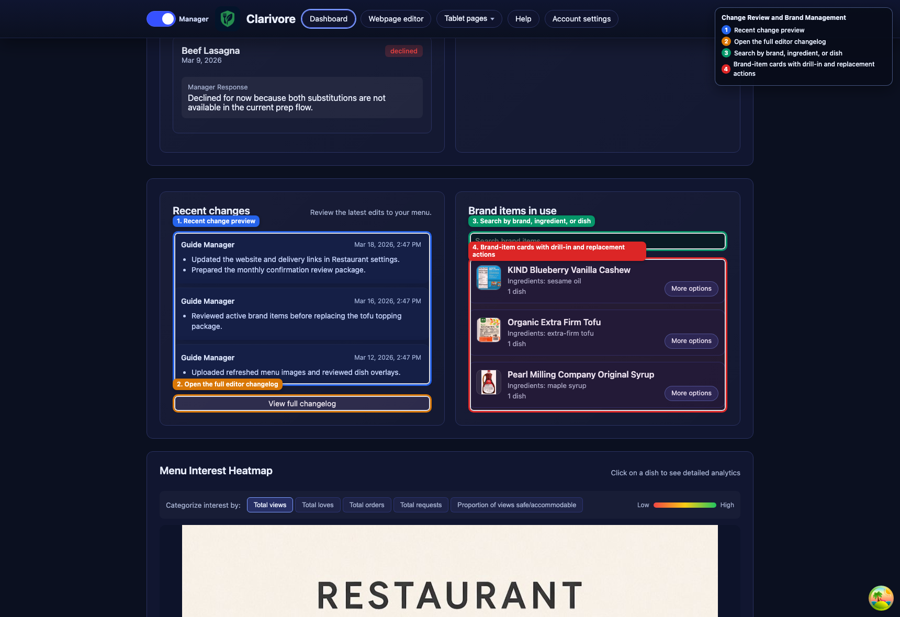

Callout mapping:

1. Recent changes preview list.
2. Open full changelog action.
3. Brand item search.
4. Brand cards with dish links and replace workflow.

#### Execution steps

1. Scan `Recent changes` for unexpected edits.
2. Use `View full changelog` when an edit needs full historical context.
3. In `Brand items in use`, search for target item by name/ingredient/dish.
4. Expand `More options` for full brand context.
5. Use `Open` to jump to dish editor context, or `Replace item` for replacement flow.

### 2.8 Interpret analytics and prioritize actions

#### Flow diagrams



#### Panel reference

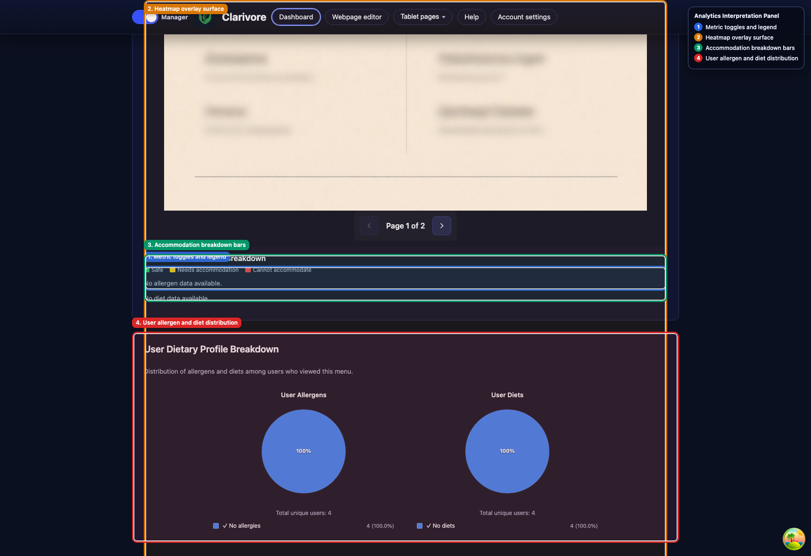

Callout mapping:

1. Metric toggles and legend controls.
2. Dish-level heatmap surface.
3. Accommodation breakdown bars.
4. User allergen/diet distribution panel.

#### Metric meaning

- `Total views`: discovery demand.
- `Total loves`: preference signal.
- `Total orders`: conversion signal.
- `Total requests`: accommodation friction.
- `% accommodated`: compatibility fit signal.

#### Interpretation playbook

1. Start with `views` and `orders` to identify high-impact dishes.
2. Switch to `requests` and `% accommodated` to identify friction hotspots.
3. Cross-check hotspots with user profile panel to estimate customer impact.
4. Create remediation tasks in editor for high-demand, low-fit dishes.

## Task type 3: Edit and publish the menu safely

### 3.1 Objective

Use webpage editor tools to maintain menu pages, overlays, dish data, settings, and monthly confirmations with safe publish behavior.

### 3.2 Flow diagrams



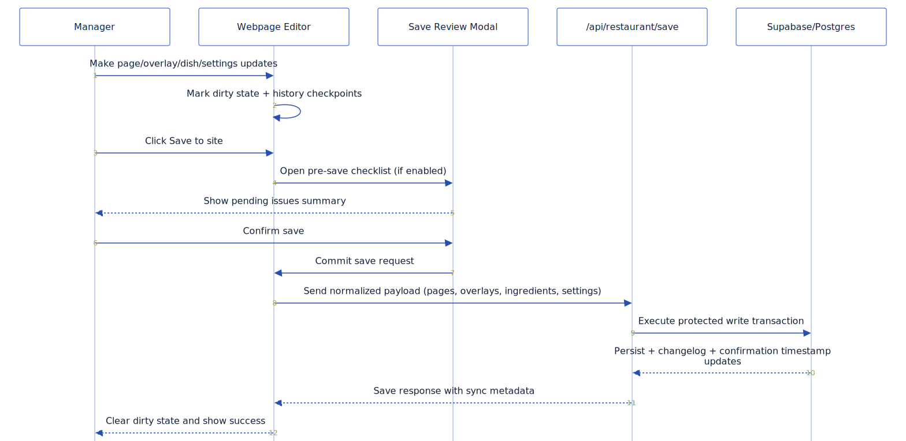

### 3.3 Editor core controls reference

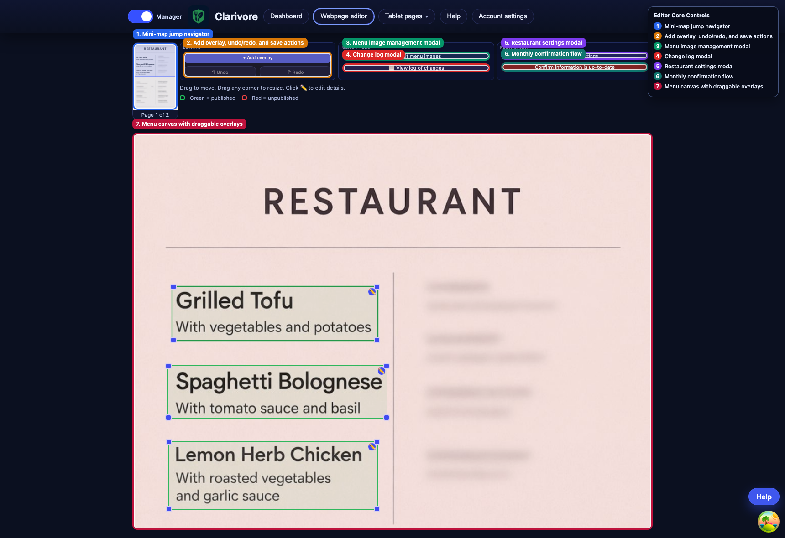

Callout mapping:

1. Minimap jump navigator.
2. Add overlay, undo/redo, and save actions.
3. Menu image management modal entry.
4. Changelog modal entry.
5. Restaurant settings entry.
6. Monthly confirmation entry.
7. Menu canvas with draggable overlays.

### 3.4 Core editor operations

#### Add or modify overlay boxes

1. Use `+ Add overlay` to create a new dish box.
2. Drag overlay to reposition.
3. Drag corners to resize.
4. Click `Edit` badge to open dish editor.

#### Undo and redo

1. Use `Undo` to step backward through local history.
2. Use `Redo` to reapply reverted changes.
3. Confirm final state before save.

#### Save behavior

1. `Save to site` publishes staged changes.
2. Save can be blocked when ingredient confirmations are unresolved.
3. Use confirmation guide controls to resolve outstanding rows before save.

### 3.5 Dish editor and ingredient management

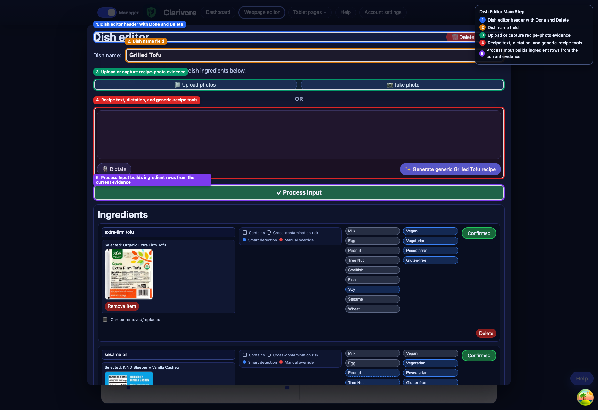

Callout mapping:

1. Dish header with `Done` and `Delete` actions.
2. Upload/camera controls for recipe evidence.
3. Recipe text and dictation input area.
4. `Process Input` action.
5. Ingredient rows with brand assignment and confirmation controls.

Execution steps:

1. Open overlay dish editor.
2. Set accurate dish name.
3. Add photo evidence and/or recipe text.
4. Run `Process Input`.
5. Verify each ingredient row and assign/confirm brand items.
6. Resolve warnings and confirm all required rows.
7. Click `Done`.

### 3.6 Changelog review inside editor

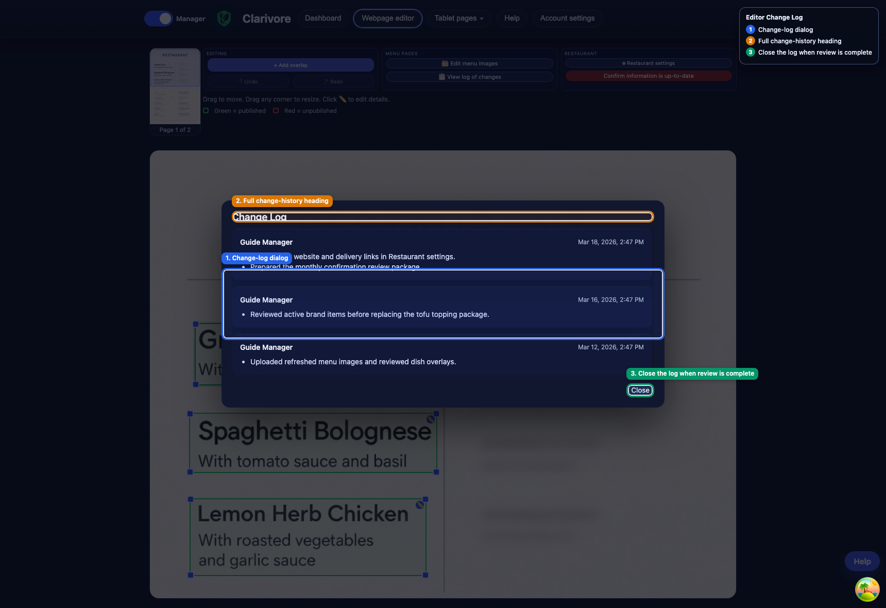

Callout mapping:

1. Changelog modal container.
2. Change history context.
3. Close control.

Execution steps:

1. Open `View log of changes`.
2. Review entries for unintended edits before publishing.
3. Close modal and continue editing or save.

### 3.7 Menu page management

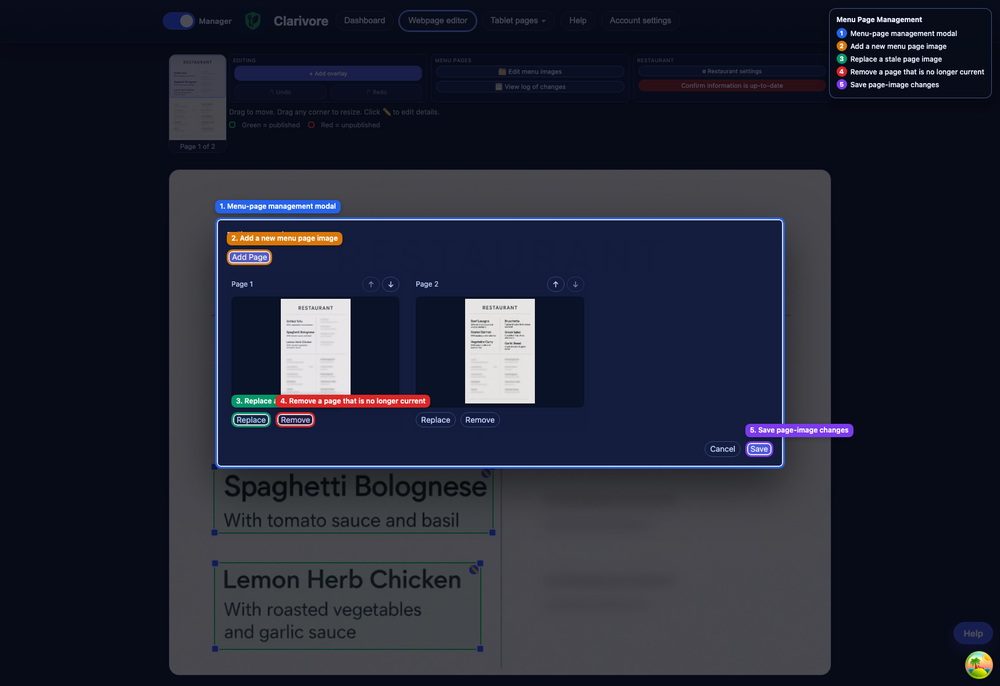

Callout mapping:

1. Menu image modal container.
2. Add page action.
3. Replace page action.
4. Remove page action.
5. Save page updates action.

Execution steps:

1. Open `Edit menu images`.
2. Add missing pages, replace stale scans, remove obsolete pages.
3. Save modal changes.
4. Return to editor and validate overlays still align with page content.

### 3.8 Restaurant settings management

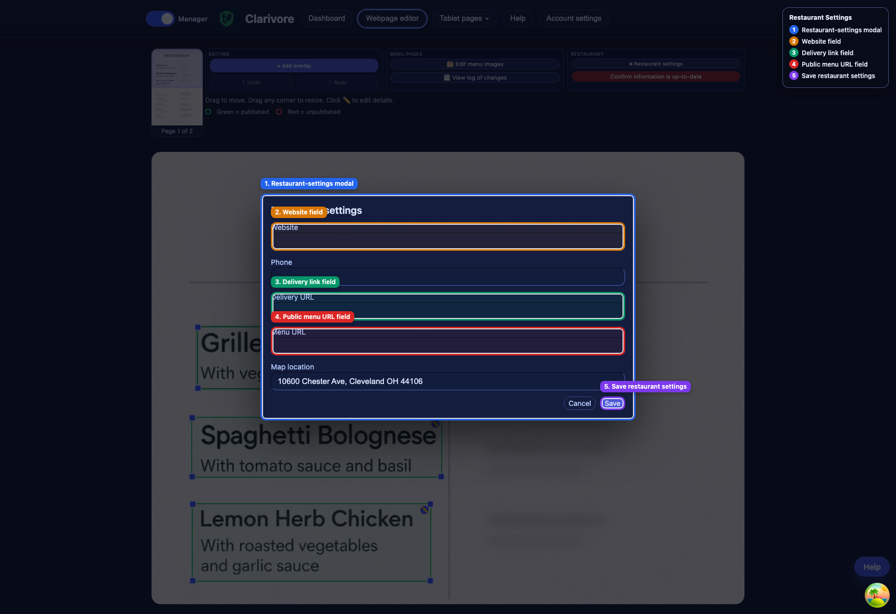

Callout mapping:

1. Restaurant settings modal container.
2. Website field.
3. Delivery URL field.
4. Menu URL field.
5. Save settings action.

Execution steps:

1. Open `Restaurant settings`.
2. Update URLs and metadata fields.
3. Save settings.
4. Perform full `Save to site` if prompted by pending changes.

### 3.9 Monthly confirmation in editor

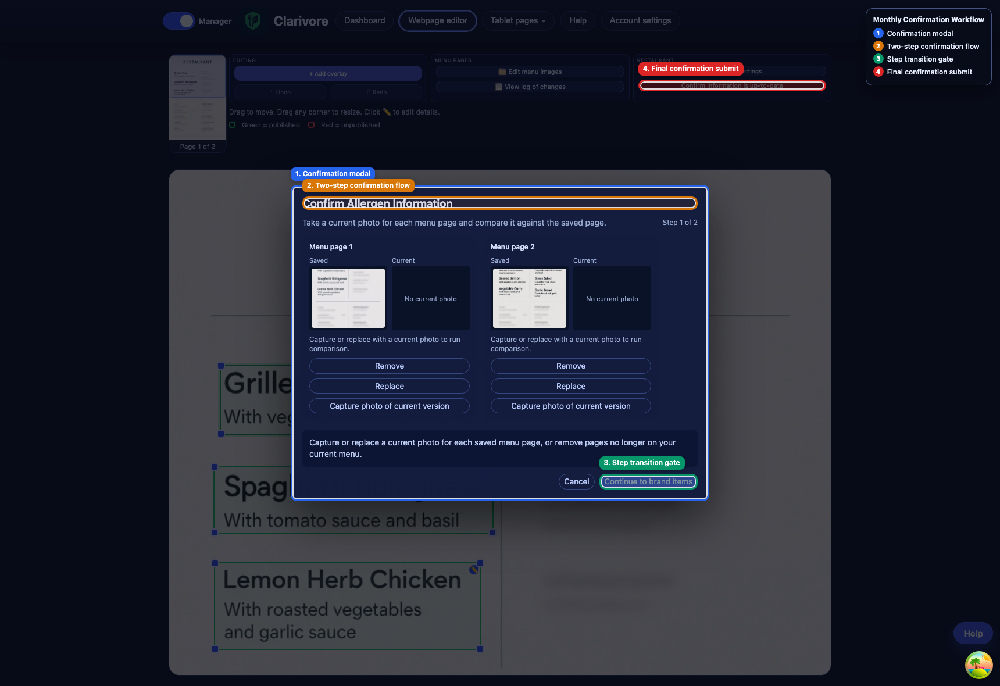

Callout mapping:

1. Confirmation modal container.
2. Step 1 menu/allergen confirmation context.
3. Continue gate to brand review.
4. Final confirmation submit action.

Execution steps:

1. Confirm all menu pages are current and attestations are complete.
2. Continue to brand verification.
3. Resolve brand mismatches.
4. Submit final confirmation.
5. Verify due-state updates back in dashboard.

## Task type 4: Validate diner experience (manager perspective)

### 4.1 Objective

Confirm that published overlays and compatibility statuses produce the expected diner-facing experience.

### 4.2 Flow diagrams



### 4.3 Viewer reference

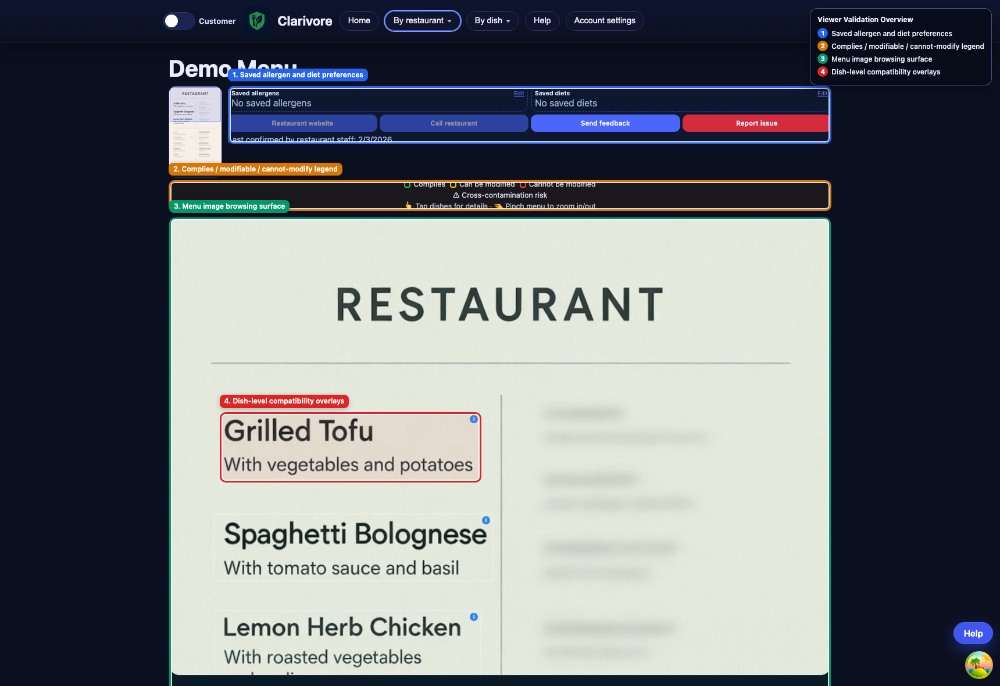

Callout mapping:

1. Saved allergen and diet preference controls.
2. Status legend (`complies`, `modifiable`, `cannot modify`).
3. Menu browsing surface.
4. Dish overlay hotspots.

### 4.4 Dish detail reference

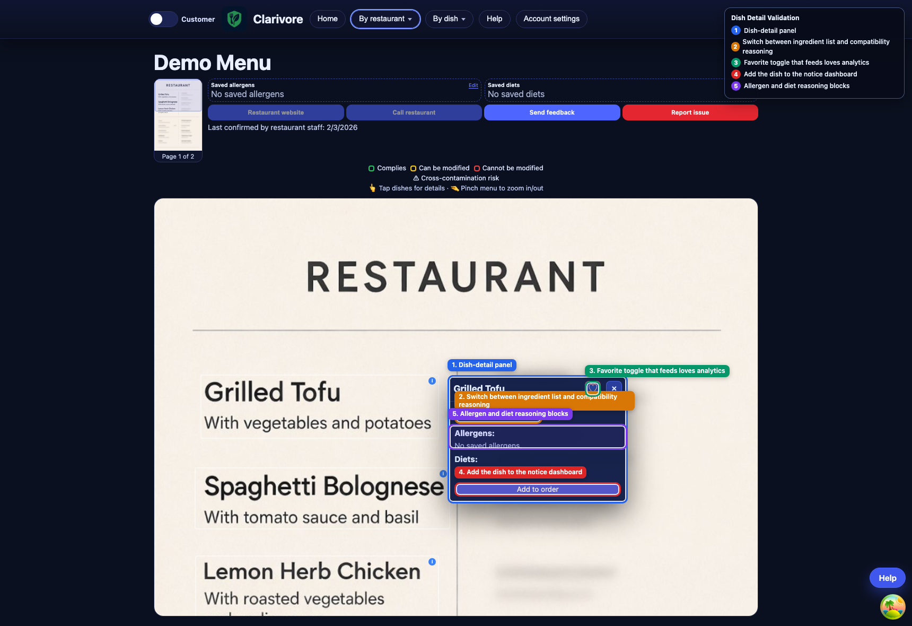

Callout mapping:

1. Dish detail popover/modal.
2. Favorite toggle (`loves` signal).
3. Order/add action (`orders` signal).
4. Allergen and diet reasoning sections.

### 4.5 Validation procedure

1. Open viewer mode for the target restaurant.
2. Apply representative allergen and diet profile.
3. Confirm overlay statuses align with known dish constraints.
4. Open dish details and verify reasoning text is consistent with ingredient data.
5. If mismatch exists, return to editor and correct data before republishing.

## Task type 5: Tablet pages operations

### 5.1 Objective

Use `Tablet pages` navigation as an operational monitor for service and kitchen workflows.

### 5.2 Flow diagrams

### 5.3 Execution procedure

1. In topbar, open `Tablet pages`.
2. Select `Server tablet` or `Kitchen tablet`.
3. Verify diner notices and operational signals are appearing.
4. Route required actions to kitchen/service teams.
5. Confirm related follow-up in manager direct messages.

## Task type 6: Troubleshoot and escalate

### 6.1 Flow diagram

### 6.2 Symptom-to-action matrix

| Symptom | Likely cause | Immediate action |
| --- | --- | --- |
| Sign in required | No active session | Sign in at `/account?mode=signin` |
| Manager access required | Missing manager assignment | Request assignment/reapply invite |
| Dashboard section not loading | Runtime fetch failure | Refresh and retry |
| Request action failed | Write or context mismatch | Retry once and verify restaurant context |
| Replacement appears not applied | Change staged but unsaved | Reconfirm rows and click `Save to site` |
| Confirmation cannot submit | Missing attestations or unresolved brand/page checks | Complete all gating requirements |
| Notifications missing | Browser permission or account mismatch | Verify notification permission and active manager session |

### 6.3 Escalation payload template

Include all of the following in escalation:

1. Restaurant name.
2. Full URL.
3. Action attempted.
4. Error text.
5. Timestamp and timezone.
6. Annotated screenshot or short recording.

## Task type 7: Cadence and governance

### 7.1 Daily checklist

1. Read and respond to direct messages.
2. Clear pending accommodation queue or assign owners.
3. Check confirmation due-state and route work before risk window.
4. Review heatmap and dietary profile for new friction patterns.
5. Escalate blockers with evidence.

### 7.2 Weekly checklist

1. Audit changelog for risky edits.
2. Review brand-item drift and run replacements where needed.
3. Perform viewer validation spot checks on high-volume dishes.
4. Confirm request-status hygiene in `All` history.

### 7.3 Monthly checklist

1. Complete confirmation flow before due date.
2. Review repeated request hotspots and plan remediation.
3. Verify unresolved escalations are closed.
4. Validate top-demand dishes for compatibility accuracy.

## Feature inventory by manager task

### Dashboard operations

- Mode toggle and manager navigation.
- Direct message inbox, send, acknowledge.
- Accommodation queue with status transitions.
- Confirmation due-state panel and editor deep-link.
- Recent changes preview and full changelog access.
- Brand item discovery, dish deep-links, replace-item flow.
- Heatmap analytics and user profile interpretation panels.

### Editor operations

- Minimap navigation and page viewport sync.
- Overlay create/move/resize/select.
- Dish editor with recipe input, process action, ingredient confirmations.
- Undo/redo and staged change handling.
- Menu page add/replace/remove workflow.
- Restaurant settings modal.
- Save-to-site publish action.
- Confirmation workflow entry and submission.

### Experience validation operations

- Viewer mode preference controls.
- Overlay status legend interpretation.
- Dish compatibility validation from manager perspective.

### Governance operations

- Tablet page monitoring.
- Notifications and reminder checks.
- Troubleshooting and escalation standards.

## Rebuild commands

- Regenerate diagrams: `npm run docs:flows:build`
- Regenerate screenshots: `npm run docs:flows:capture`
- Lint manager docs: `npm run docs:lint`
- Export PDF: `npm run docs:manager:pdf`
