# Clarivore Manager User Guide

This guide supersedes every earlier manager guide for Clarivore.

All screenshots in this manual were captured from the `demo-menu` restaurant using a real manager account with live manager access, live dashboard data, live editor access, and live tablet permissions. The guide is intentionally desktop-first because that is the clearest way to document the full manager workflow surface.

## What This Guide Covers

- Manager dashboard
- Webpage editor
- Viewer validation from the manager perspective
- Server tablet
- Kitchen tablet
- Help
- Account settings

## How To Use This Guide

1. Start with `Manager Surface Map` so you know where each part of the product lives.
2. Use the workflow sections when you are trying to complete a task.
3. Use the numbered callouts on each screenshot to identify exactly which button, panel, badge, or field matters.
4. Use the diagrams at the start of each section to understand the full workflow before you click anything.
5. Use `Troubleshooting And Escalation` if what you see does not match the expected screenshots.

## Manager Surface Map



### Navigation map

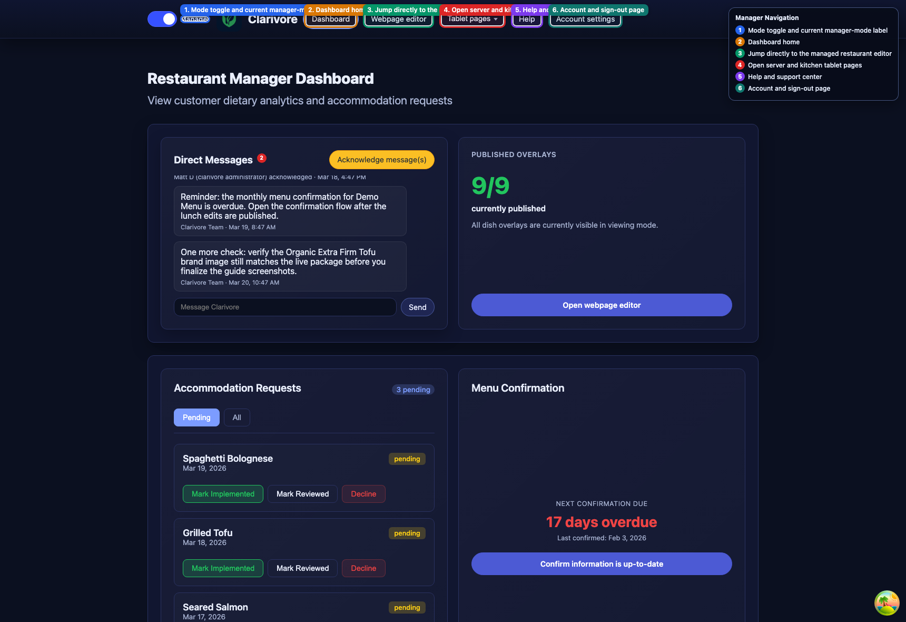

Callout mapping:

1. Manager mode toggle and label. This confirms you are in the manager surface, not the diner surface.
2. Dashboard. This is the daily command center for messages, requests, confirmations, change review, brand review, and analytics.
3. Webpage editor. This opens the managed restaurant's menu editor.
4. Tablet pages. This opens the server and kitchen tablet surfaces.
5. Help. This opens the support area for manager chat, issue reporting, and Clarivore help search.
6. Account settings. This opens your profile and sign-out controls.

### Tablet pages menu

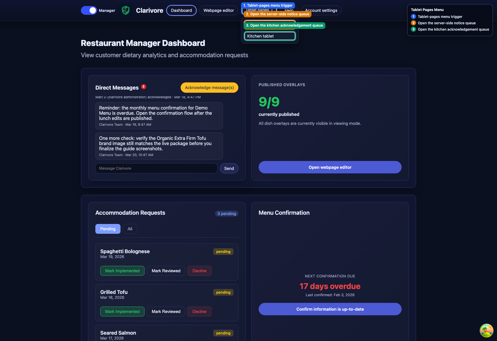

Callout mapping:

1. Tablet-pages menu trigger. Use this when you need the operational notice queues.
2. Server tablet. This is where notices first arrive for approval and dispatch.
3. Kitchen tablet. This is where the kitchen acknowledges notices and asks follow-up questions.

### Access checkpoints

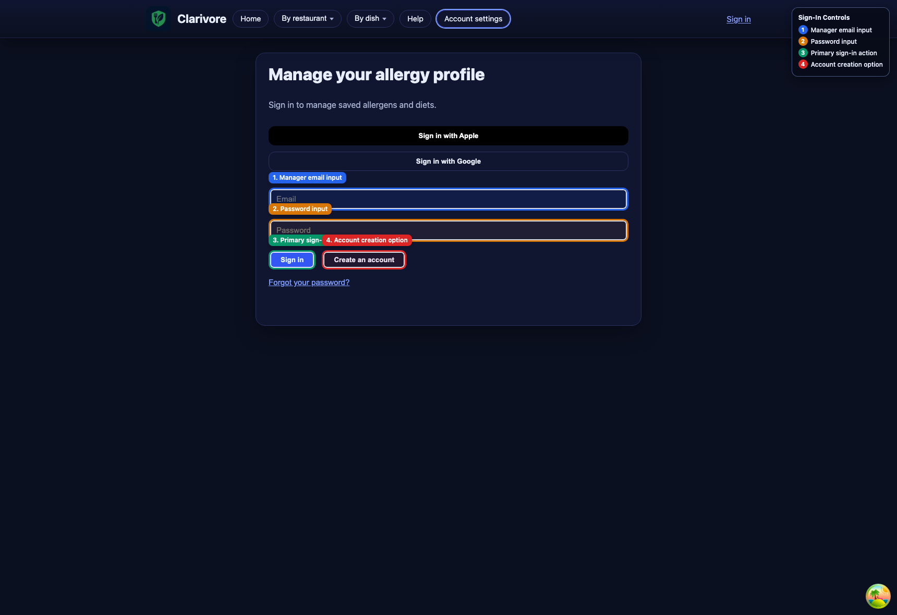

Callout mapping:

1. Manager email input.
2. Password input.
3. Primary sign-in button.
4. Account-creation path if a manager account has not been provisioned yet.

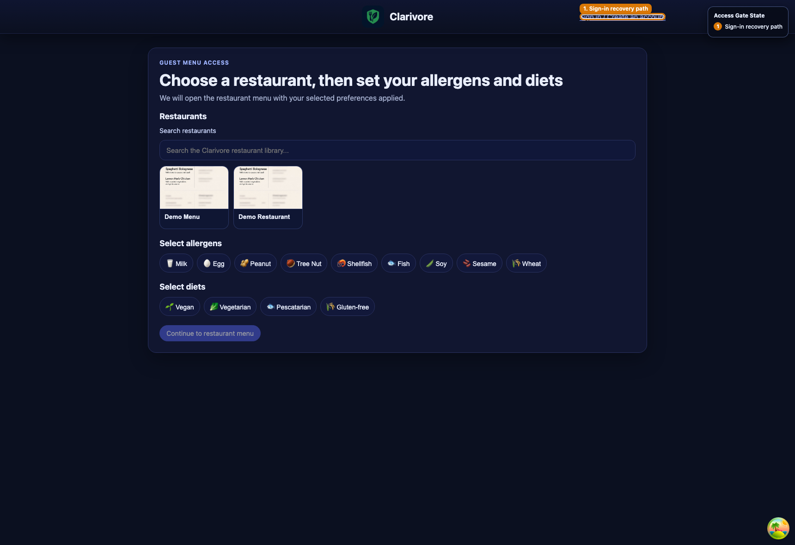

Callout mapping:

1. Authentication-required state. You will see this if you try to open the dashboard without a valid session.
2. Sign-in recovery link.

What this means:

- If you see the sign-in form, you are not signed in yet.
- If you see the auth-required screen, go back through sign-in.
- If you sign in successfully and still cannot reach the dashboard, the account likely does not have manager or owner access for the current restaurant.

## Workflow 1: Sign In And Verify Access

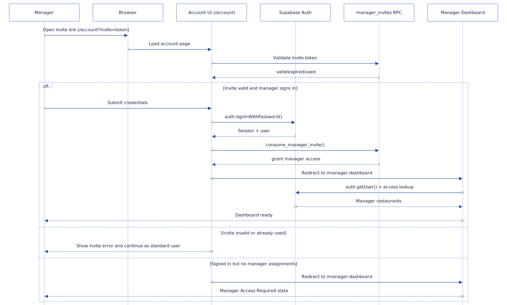



### Step 1: Sign in with manager credentials

What to do:

1. Enter the manager email.
2. Enter the password.
3. Click `Sign in`.

What good looks like:

- You are redirected into Clarivore with manager navigation available.

### Step 2: Confirm the dashboard loads correctly

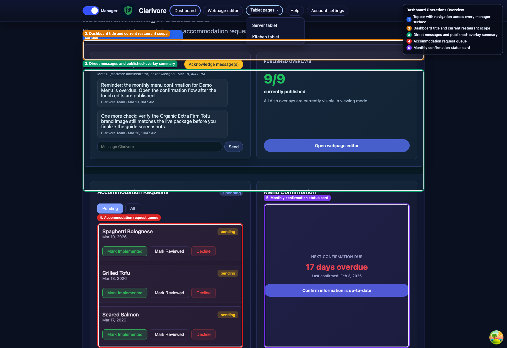

Callout mapping:

1. Topbar. This confirms the full manager navigation is present.
2. Dashboard heading. This confirms you are on the correct page.
3. Direct-messages area. This confirms live manager communication is loading.
4. Accommodation requests. This confirms live request data is loading.
5. Monthly confirmation card. This confirms confirmation status is loading.

What good looks like:

- The page header reads as the restaurant manager dashboard.
- Direct messages, requests, confirmation, changes, and analytics sections all render.
- Buttons are active and not replaced by an auth or error state.

### Step 3: Recognize the signed-out state when it happens

What to do:

1. Use the recovery link.
2. Sign in again.
3. Return to `/manager-dashboard`.

## Workflow 2: Run The Manager Dashboard



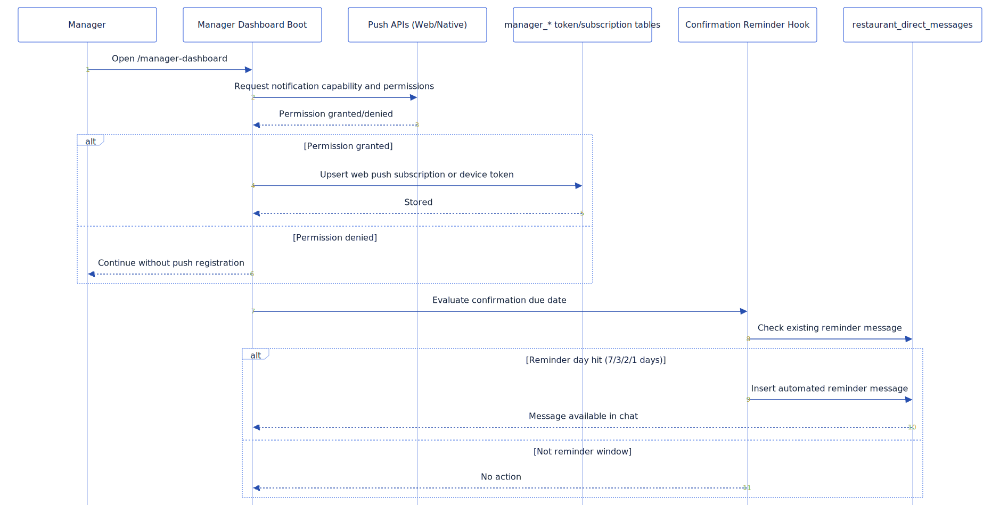

### Dashboard overview

What this screen tells you at a glance:

1. You are in the manager surface, not the diner surface.
2. Direct messages need attention if an unread badge is visible.
3. Accommodation requests need attention if pending requests are visible.
4. Monthly confirmation needs attention if the due state is near due, due today, or overdue.
5. The rest of the page continues downward into recent changes, brand items, and analytics.

### Workflow 2A: Review And Respond To Direct Messages

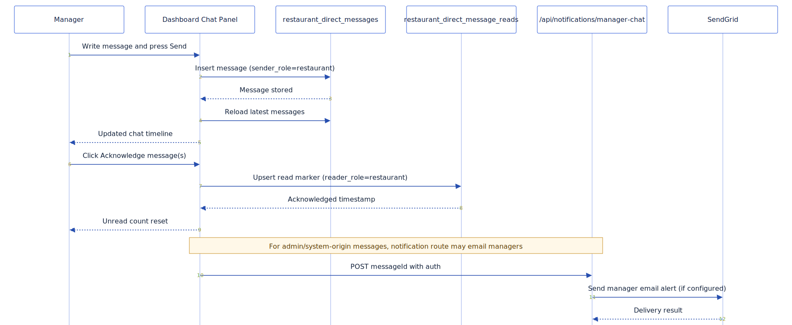

#### Step 1: Review unread admin context

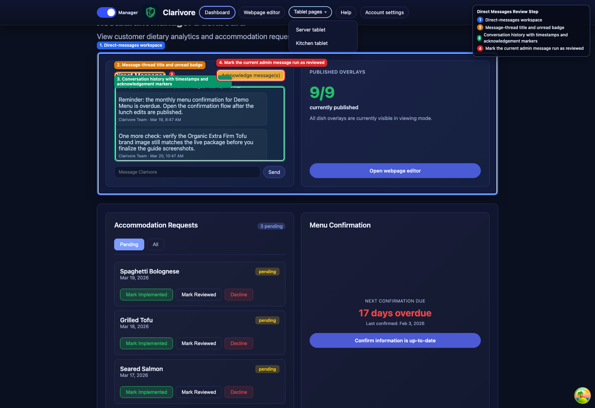

Callout mapping:

1. Direct-messages workspace.
2. Thread title and unread badge.
3. Message history with timestamps and acknowledgement markers.
4. `Acknowledge message(s)`. This clears the current unread admin run after you have processed it.

What to look for:

- Operational reminders
- Follow-up requests from Clarivore
- Questions about brand items, requests, or confirmation status

#### Step 2: Send a manager response

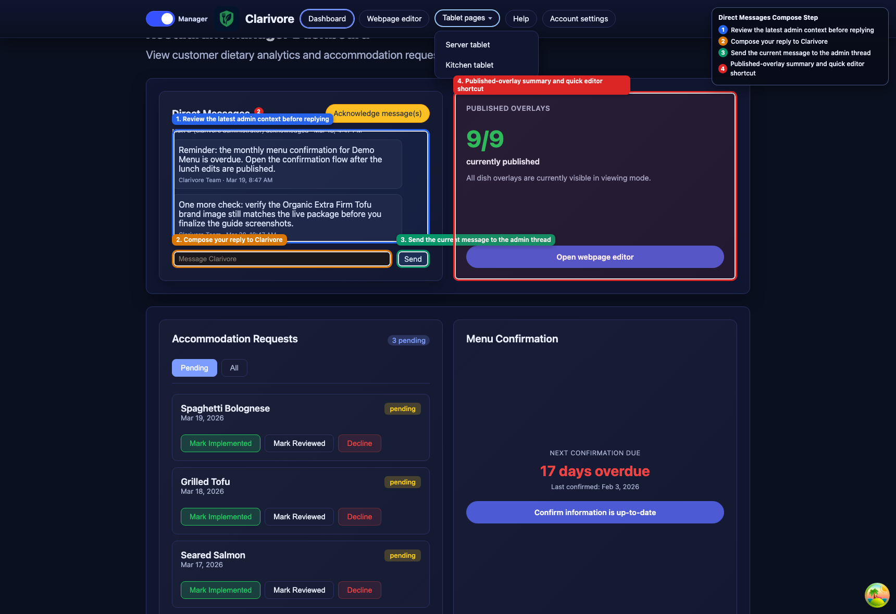

Callout mapping:

1. Conversation history. Read this first.
2. Message input. Type the manager response here.
3. `Send`. This sends the response into the live manager-admin thread.
4. Published-overlay summary. This is a useful side signal if the message relates to publish state.

Recommended response structure:

- Issue
- Restaurant impact
- What you already checked
- What you need from Clarivore

When to use `Acknowledge message(s)`:

- After you have read and acted on the current unread admin messages
- After you have replied, if a reply was needed
- Not before you understand what the message is asking for

### Workflow 2B: Triage Accommodation Requests

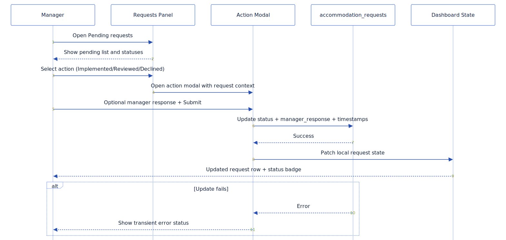



#### Step 1: Review the pending queue

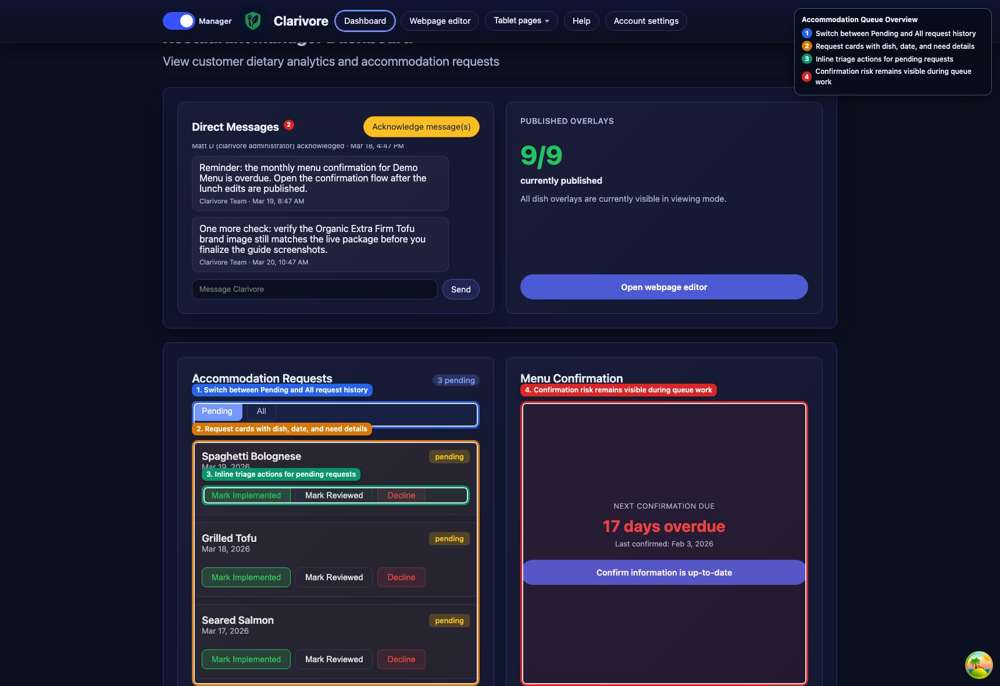

Callout mapping:

1. `Pending` and `All` tabs.
2. Request cards showing the dish, date, and requested accommodations.
3. Inline triage buttons.
4. Confirmation card still visible so you do not lose due-date awareness while triaging.

How to read each request card:

- Dish name: the menu item the diner could not confidently order
- Date: when the request was created
- Status badge: current state of the request
- Allergen accommodations needed: requested allergen-safe coverage
- Dietary accommodations needed: requested diet-safe coverage

#### Step 2: Choose the correct request action

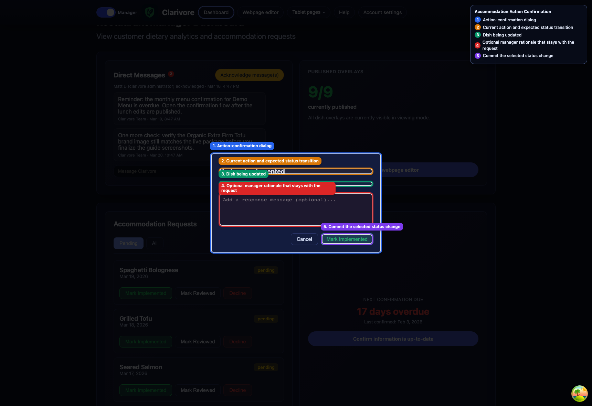

Callout mapping:

1. Action-confirmation dialog.
2. Action title. This tells you whether you are marking the request implemented, reviewed, or declined.
3. Dish context.
4. Optional manager rationale.
5. Final submit button for the selected action.

How to choose the correct status:

- `Mark Implemented`: use this only when the restaurant can now truly support the accommodation.
- `Mark Reviewed`: use this when the request has been investigated but the menu/editor change is not yet complete.
- `Decline`: use this when the accommodation cannot be supported.

When to add a response note:

- When the reason is not obvious from the menu
- When you need to document a temporary workaround
- When you are clarifying why a request was declined or only reviewed

#### Step 3: Verify the history view

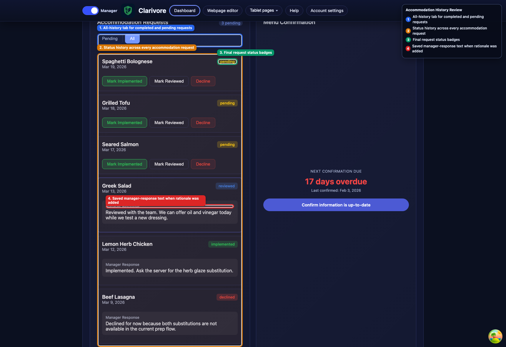

Callout mapping:

1. `All` history tab.
2. Request history list across pending and non-pending requests.
3. Final status badges.
4. Saved manager response text.

Why this matters:

- `All` is your audit trail.
- It lets you confirm that a status change actually persisted.
- It shows future managers what decision was made and why.

### Workflow 2C: Check Monthly Confirmation Status



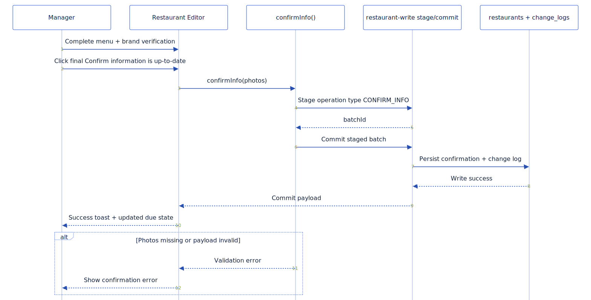

#### Step 1: Review the dashboard card every day

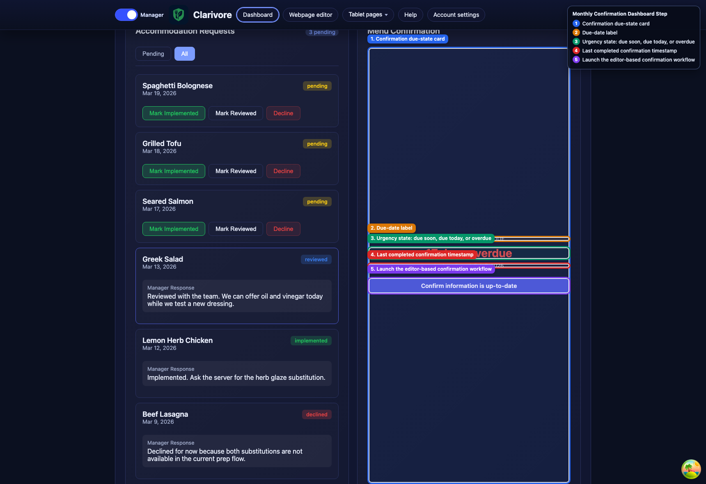

Callout mapping:

1. Confirmation due-state card.
2. Due-date label.
3. Due-state urgency text.
4. Last confirmed timestamp.
5. `Confirm information is up-to-date`. This opens the confirmation workflow in the editor.

How to read the due state:

- `Due in N days`: on track
- `Due today`: needs action now
- `X days overdue`: highest urgency

What to do if overdue:

1. Open the editor immediately from this button.
2. Verify pages, overlays, and brand items.
3. Complete both confirmation steps before returning to other work.

### Workflow 2D: Review Recent Changes And Brand Items



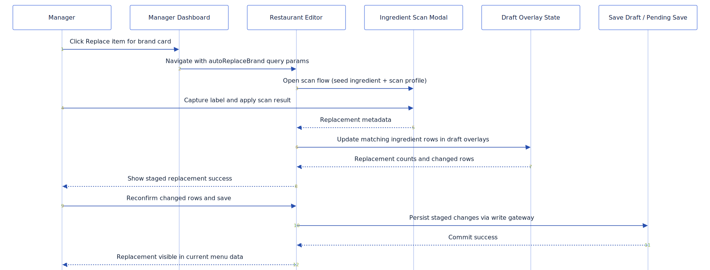

#### Step 1: Review recent changes

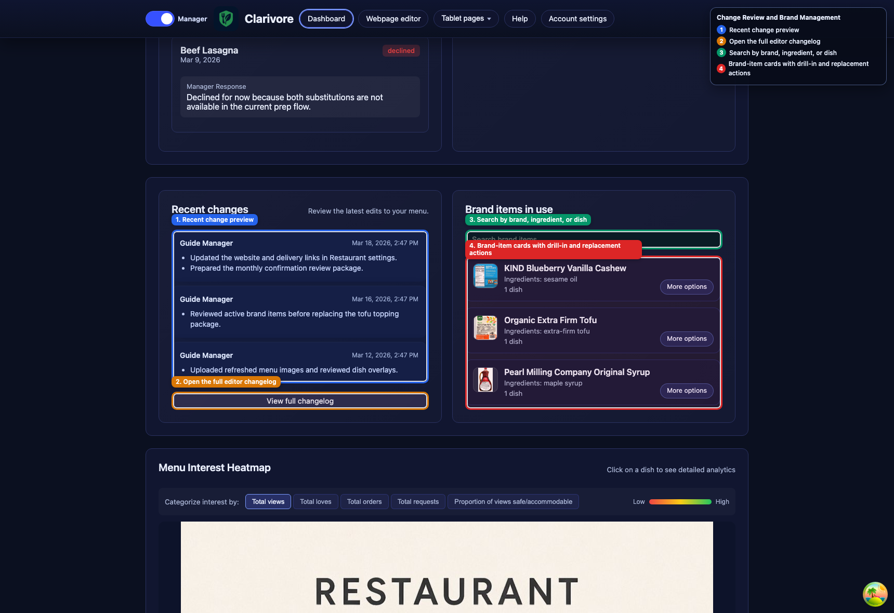

Callout mapping:

1. Recent change preview.
2. `View full changelog`.
3. Brand search field.
4. Brand-item list.

How to use the recent-changes side:

1. Scan for unexpected edits.
2. Open the full changelog if a change needs more context.
3. Use the editor if you need to inspect the affected dish directly.

#### Step 2: Expand a brand item before acting on it

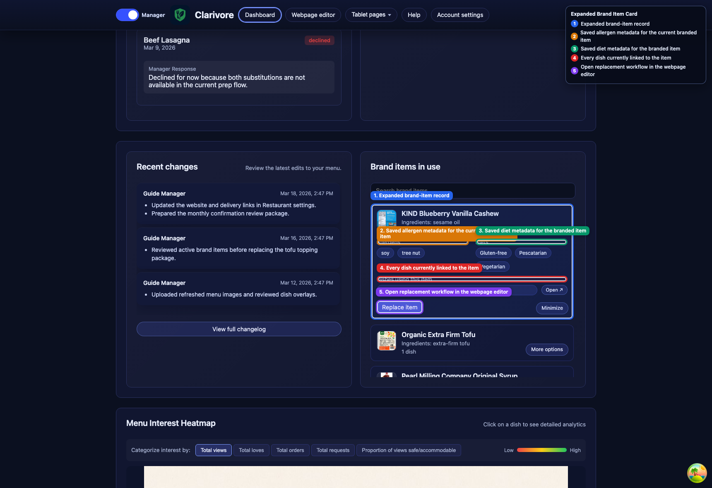

Callout mapping:

1. Expanded brand-item record.
2. Saved allergen metadata for the item.
3. Saved diet metadata for the item.
4. Dishes using the item.
5. `Replace item`.

How to use this panel:

1. Search by brand name, ingredient name, or dish name.
2. Open `More options`.
3. Check whether the item is attached to the expected dishes.
4. Use `Replace item` if the branded product on-site has changed.

### Workflow 2E: Use Analytics To Prioritize Work



#### Step 1: Read the heatmap and aggregate panels

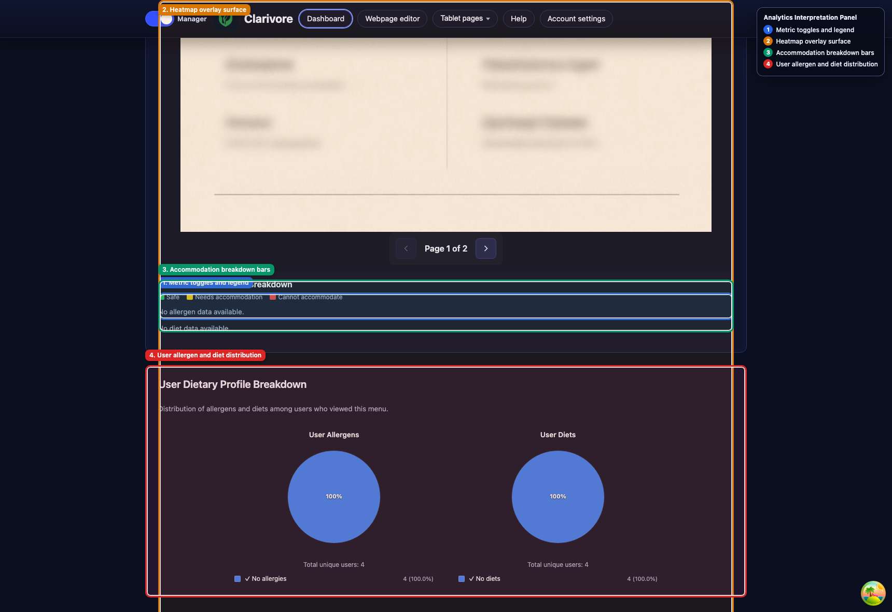

Callout mapping:

1. Metric toggles and legend.
2. Heatmap overlay surface.
3. Accommodation breakdown bars.
4. User allergen and diet distribution.

How to use the metrics:

- `Total views`: demand signal
- `Total loves`: preference signal
- `Total orders`: conversion signal
- `Total requests`: friction signal
- `Proportion of views safe/accommodable`: fit signal

#### Step 2: Click a dish to inspect the underlying conflict pattern

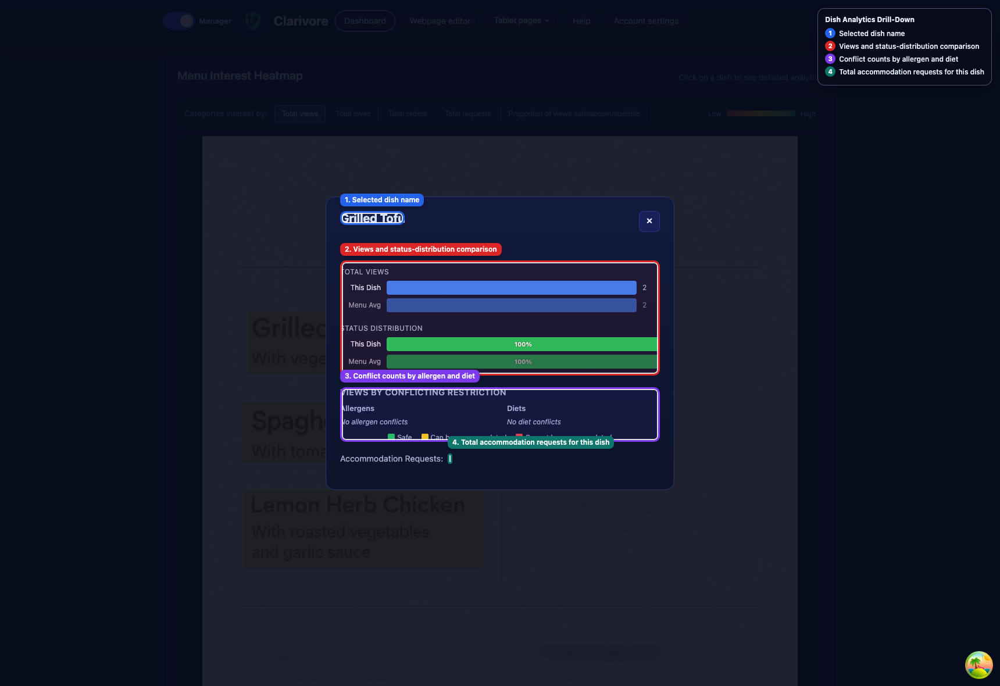

Callout mapping:

1. Selected dish name.
2. Restrictions that cannot be accommodated.
3. Restrictions that can be accommodated.
4. Views and status-distribution comparison.
5. Conflict counts by allergen and diet.
6. Total accommodation requests for the dish.

How to interpret the drill-down:

1. If views are high and requests are high, the dish is creating friction for real demand.
2. If the conflict bars cluster around a single allergen or diet, that is your clearest remediation target.
3. If the dish is high-view but low-order, the fit or explanation may be weak.

## Workflow 3: Edit And Publish Safely



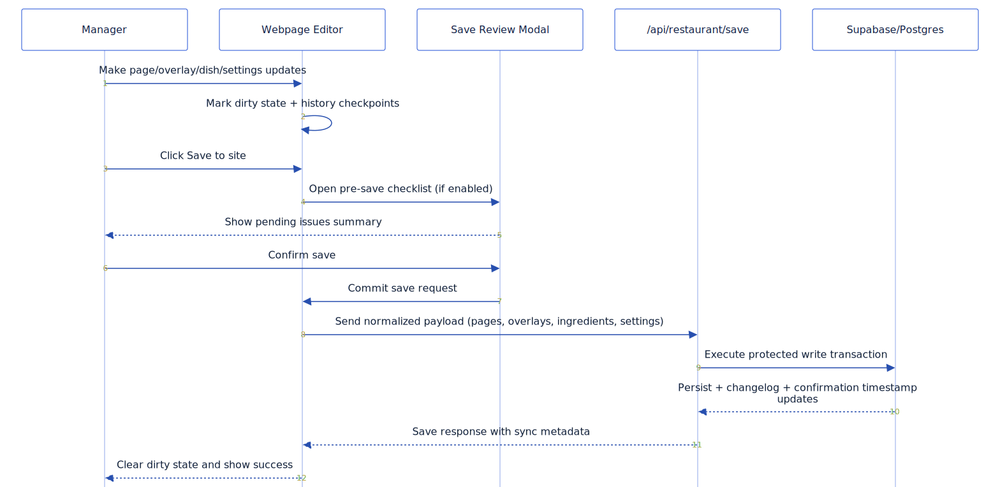

### Workflow 3A: Orient Yourself In The Webpage Editor

#### Step 1: Review the editor shell before touching anything

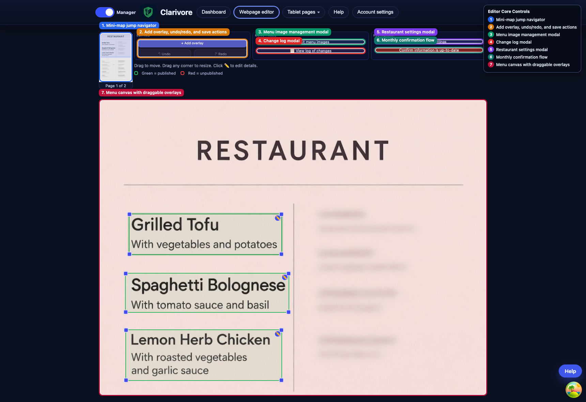

Callout mapping:

1. Mini-map jump navigator.
2. Editing controls: add overlay, undo, redo, save.
3. Menu page management.
4. Change log.
5. Restaurant settings.
6. Monthly confirmation entry point.
7. Menu canvas with draggable overlays.

What each toolbar group does:

- `Editing`: change overlays and publish updates
- `Menu pages`: manage the underlying page images
- `Restaurant`: update restaurant metadata and run monthly confirmation

### Workflow 3B: Open The Right Dish Overlay

#### Step 1: Locate the overlay on the page

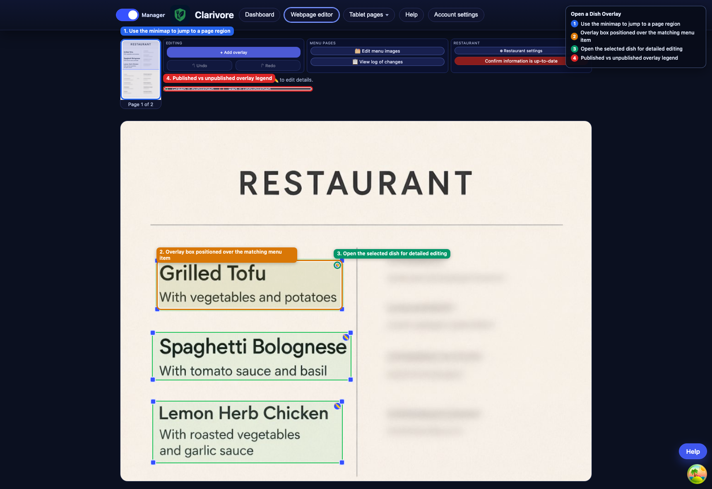

Callout mapping:

1. Mini-map jump navigator.
2. Overlay box aligned to the menu item.
3. Edit badge that opens the dish editor.
4. Published/unpublished legend.

What to verify before opening:

- The overlay is aligned to the correct dish on the scanned menu page.
- The box size roughly matches the dish text block.
- Published overlays are green.
- Unpublished overlays are red.

### Workflow 3C: Edit Dish Metadata And Evidence

#### Step 1: Review the main dish editor controls

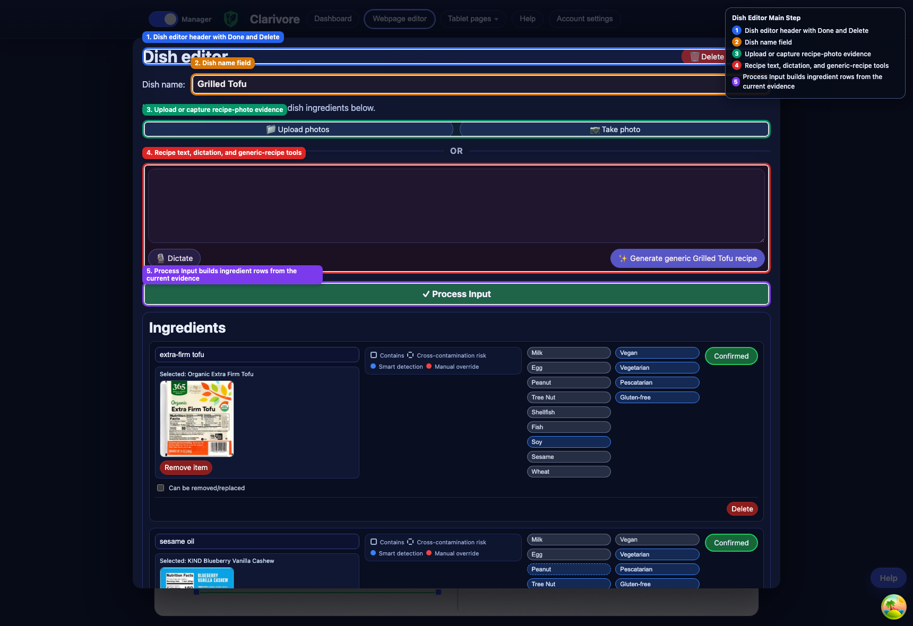

Callout mapping:

1. Dish editor header with `Done` and `Delete`.
2. Dish name field.
3. Upload or capture recipe-photo evidence.
4. Recipe text, dictation, and generic-recipe tools.
5. `Process Input`.

What to do in this step:

1. Confirm the dish name is correct.
2. Add evidence using photos, typed recipe text, or both.
3. Use dictation only when it is faster than typing and the result is still accurate.
4. Use the generic-recipe helper only as a starting point, never as a blind final answer.
5. Click `Process Input` after the evidence is ready.

### Workflow 3D: Review Ingredient Rows And The Customer Preview

#### Step 1: Confirm every ingredient row

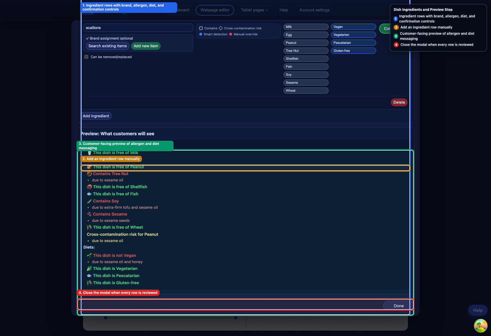

Callout mapping:

1. Ingredient rows with brand, allergen, diet, and confirmation controls.
2. `Add ingredient`.
3. Customer-facing preview of allergen and diet messaging.
4. Final `Done` action.

What must be true before you leave:

- Ingredient names are correct.
- Required brand assignments are correct.
- Allergen and diet flags are correct.
- Removability is correct.
- Rows that require confirmation are confirmed.
- The customer preview reads the way you expect a diner to see it.

### Workflow 3E: Review The Change Log

#### Step 1: Open the full editor change history

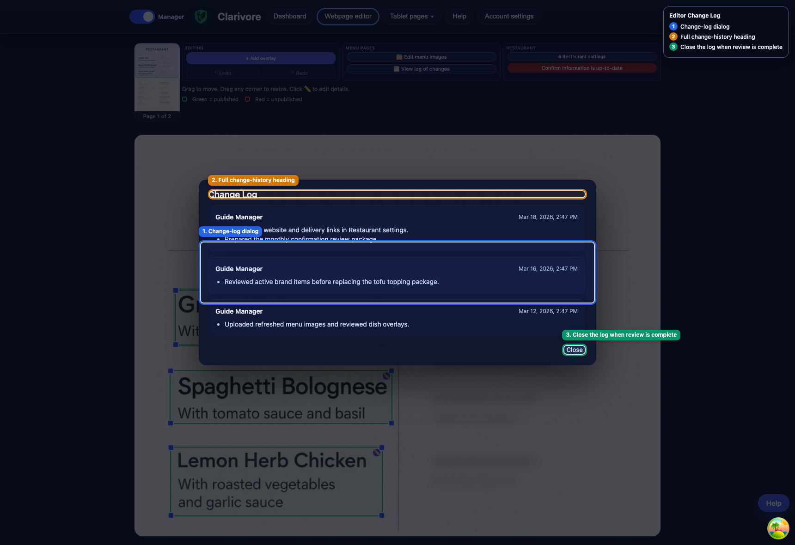

Callout mapping:

1. Change-log dialog.
2. Change-history heading.
3. Close button.

Use this when:

- You need to see exactly what changed before publishing.
- You need to confirm a replacement or confirmation action was recorded.
- You are auditing work done by another manager.

### Workflow 3F: Manage Menu Pages

#### Step 1: Update the menu images that overlays sit on top of

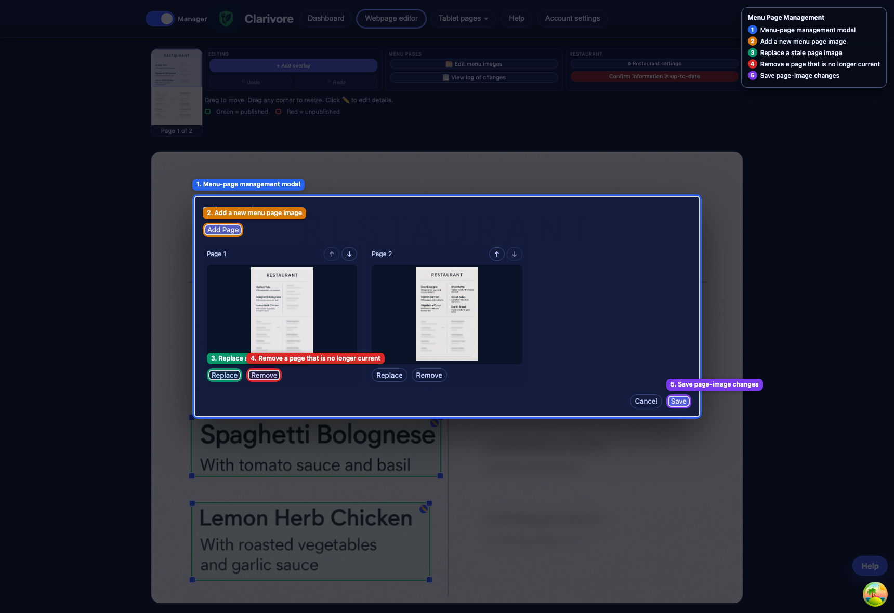

Callout mapping:

1. Menu-page management modal.
2. Add a page.
3. Replace a page.
4. Remove a page.
5. Save page changes.

Use this when:

- A new menu page has been added
- A page scan is outdated or unreadable
- A page is no longer on the current menu

After saving menu pages:

1. Return to the editor canvas.
2. Verify overlay alignment again.
3. Re-confirm any rows or overlays affected by the page change.

### Workflow 3G: Update Restaurant Settings

#### Step 1: Edit restaurant-level metadata

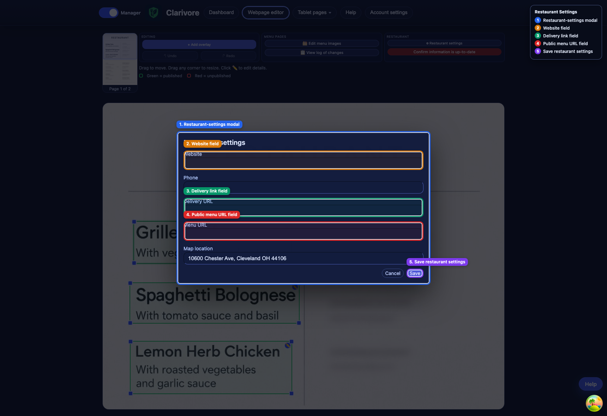

Callout mapping:

1. Restaurant-settings modal.
2. Website field.
3. Delivery URL field.
4. Menu URL field.
5. Save button.

Use this when:

- The restaurant website changes
- A delivery URL changes
- The public menu URL changes

### Workflow 3H: Review Changes Before Publishing

#### Step 1: Open the save review

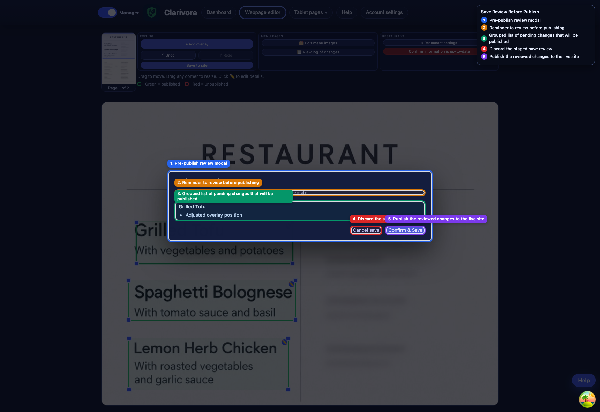

Callout mapping:

1. Pre-publish review modal.
2. Reminder to review before publishing.
3. Grouped list of pending changes.
4. `Cancel save`.
5. `Confirm & Save`.

How to use this safely:

1. Read the grouped change list from top to bottom.
2. Confirm every listed change is intentional.
3. Cancel if anything unexpected appears.
4. Only click `Confirm & Save` after you are sure the review matches the real intended update.

Important behavior:

- `Save to site` only appears when there are unsaved changes.
- If ingredient confirmations are unresolved, saving can be blocked before this modal opens.

### Workflow 3I: Complete Monthly Confirmation

#### Step 1: Complete menu verification

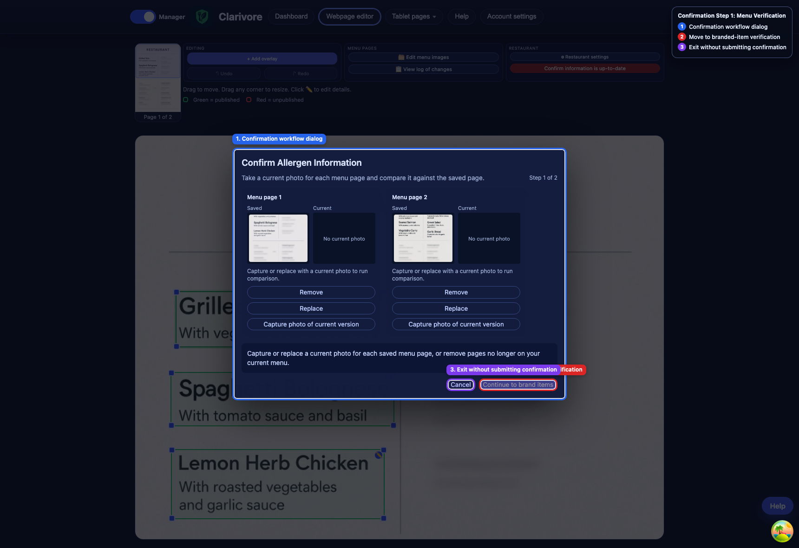

Callout mapping:

1. Confirmation workflow dialog.
2. Menu-verification step.
3. `Cancel`.

What you must do in step 1:

1. Capture or replace a current photo for each saved menu page.
2. Confirm every current photo is readable.
3. Confirm the photos represent the most current menu.
4. Continue only after the current-photo checks pass.

#### Step 2: Complete brand verification

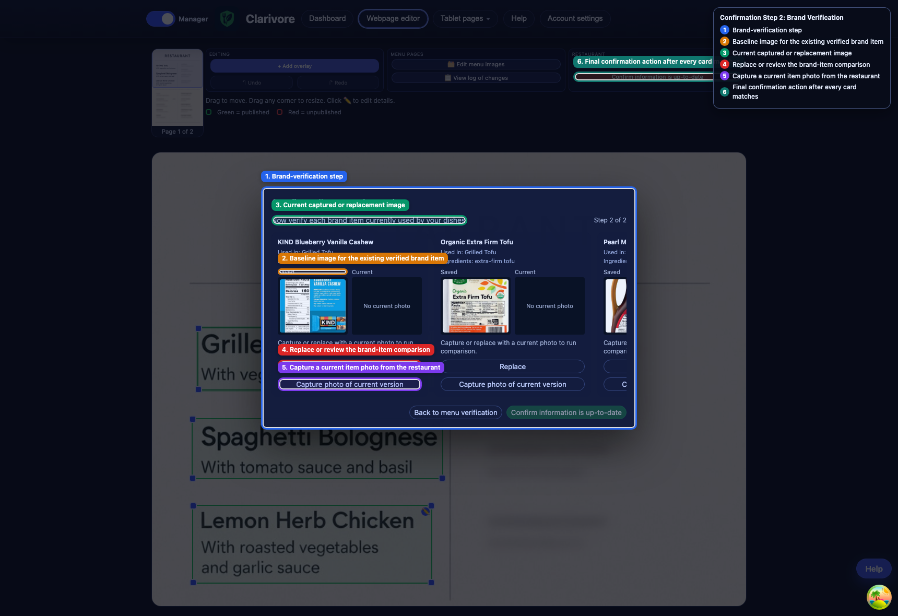

Callout mapping:

1. Brand-verification step.
2. Baseline image for an existing verified brand item.
3. Current capture or replacement image.
4. Replace or review the brand-item comparison.
5. Capture a current item photo from the restaurant.
6. Final confirmation action after every card matches.

What you must do in step 2:

1. Review every branded item shown in the dialog.
2. Capture or replace current evidence for any item that has changed.
3. Verify the current item matches the saved verified item.
4. Go back to step 1 if the menu-photo evidence is incomplete.
5. Click `Confirm information is up-to-date` only when every card is correct.

Important behavior:

- The final confirmation button is only meaningful when every required card is in a safe verified state.
- If brand items are mismatched or blocked, fix them before completing the confirmation.

## Workflow 4: Validate The Diner Experience



### Why this workflow matters

The manager dashboard and editor are only correct if the diner-facing experience is also correct. Managers should periodically validate what a diner actually sees.

### Workflow 4A: Acknowledge The Viewer Reference Banner

#### Step 1: Review the locked first-look state

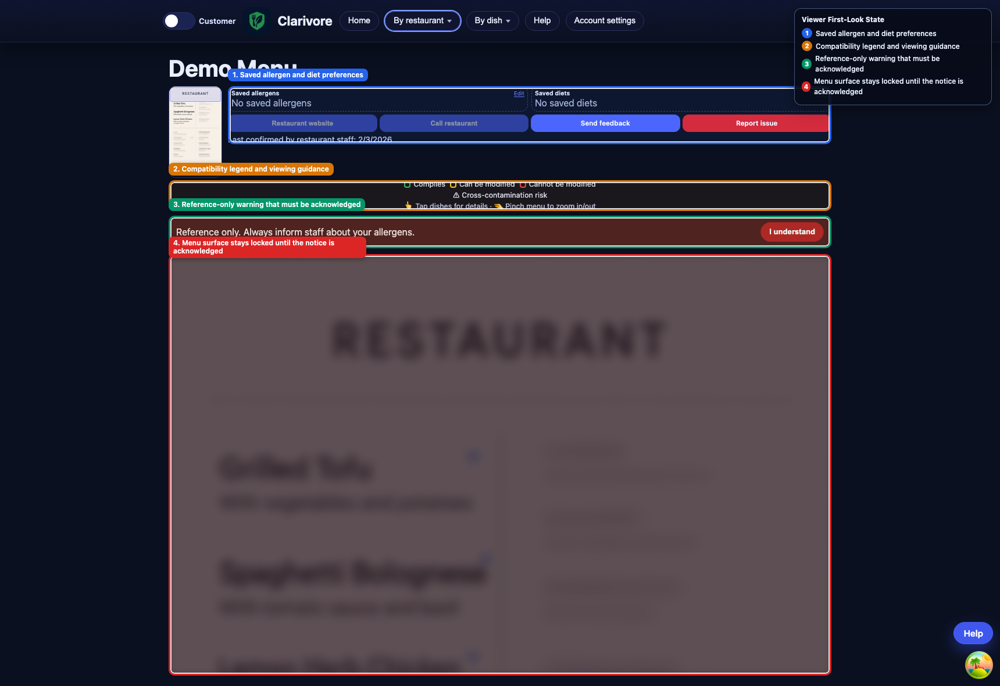

Callout mapping:

1. Saved allergen and diet preferences.
2. Compatibility legend and guidance.
3. Reference-only warning banner.
4. Locked menu stage.

What to do:

1. Read the warning.
2. Click `I understand`.
3. Continue to overlay validation.

### Workflow 4B: Review Overlay Statuses Against Preferences

#### Step 1: Inspect the unlocked viewer surface

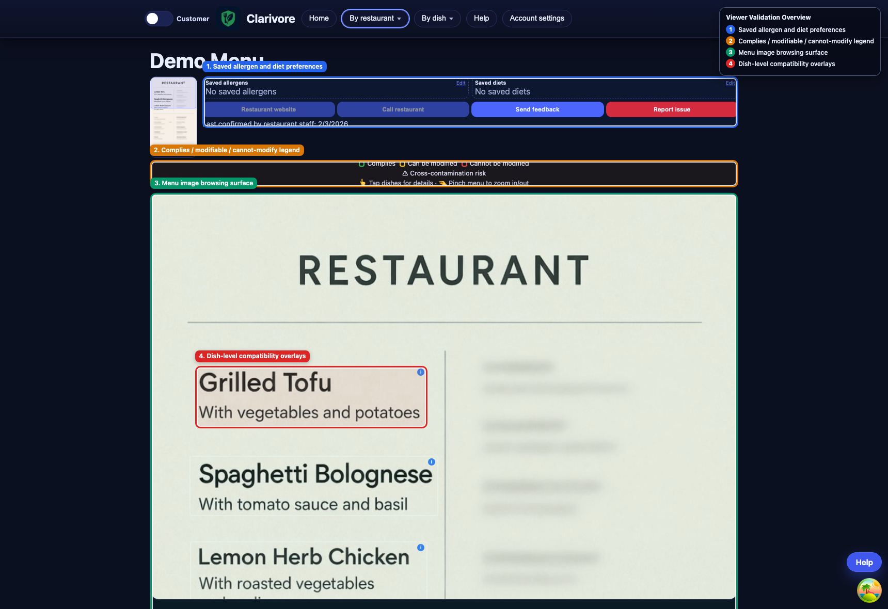

Callout mapping:

1. Saved allergen and diet preferences.
2. Compatibility legend.
3. Menu image browsing surface.
4. Dish overlays.

What to verify:

- The saved preferences are the ones you expect for the test persona.
- Dish overlays appear on the correct menu items.
- The color/status interpretation matches the known dish data.

### Workflow 4C: Open A Dish And Validate The Explanation

#### Step 1: Inspect the dish detail panel

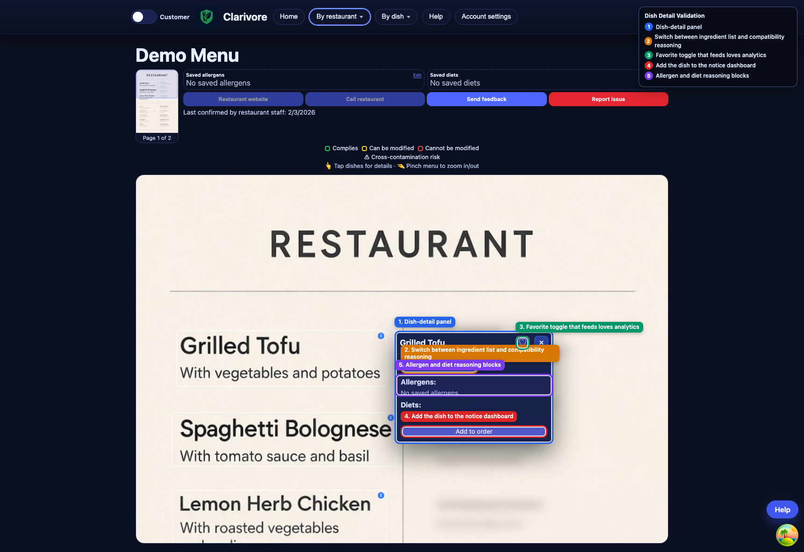

Callout mapping:

1. Dish-detail panel.
2. Toggle between ingredient list and compatibility reasoning.
3. Favorite button.
4. `Add to order`.
5. Allergen and diet reasoning sections.

What to verify:

- The ingredient list is sensible.
- The allergen reasoning matches the ingredient data.
- The diet reasoning matches the ingredient data.
- Cross-contamination or removable modifiers appear where expected.

### Workflow 4D: Test The Notice Dashboard

#### Step 1: Add a dish and inspect the notice sidebar

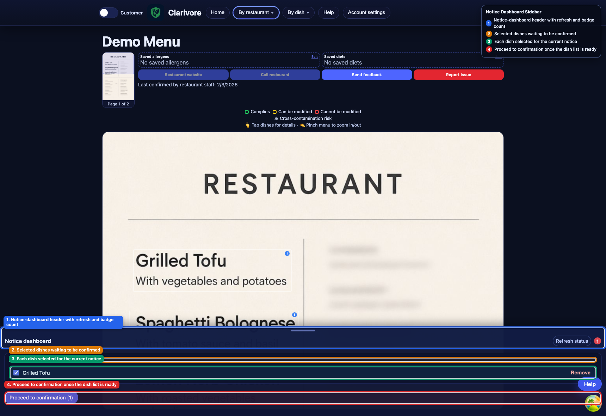

Callout mapping:

1. Notice-dashboard header.
2. Pending notices section.
3. Each selected dish.
4. `Proceed to confirmation`.

What to verify:

- The selected dish appears in the pending notice list.
- The sidebar badge reflects the notice state.
- The diner can move to confirmation with the selected dish set.

### Workflow 4E: Review The Final Notice Form

#### Step 1: Open the confirmation drawer

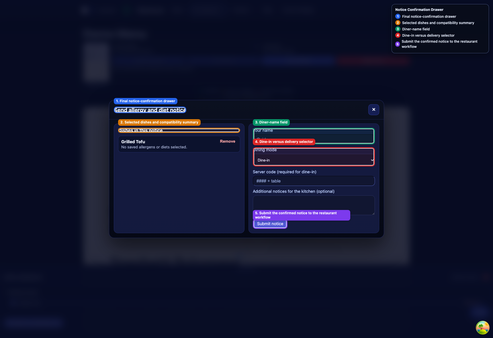

Callout mapping:

1. Final notice-confirmation drawer.
2. Dishes in this notice.
3. Name field.
4. Dining mode.
5. `Submit notice`.

What to verify:

- The selected dishes are correct.
- The compatibility summary is clear.
- Required fields are present.
- Submission is available when the form is valid.

## Workflow 5: Monitor Tablet Operations

### Workflow 5A: Use The Server Tablet

#### Step 1: Open the server queue

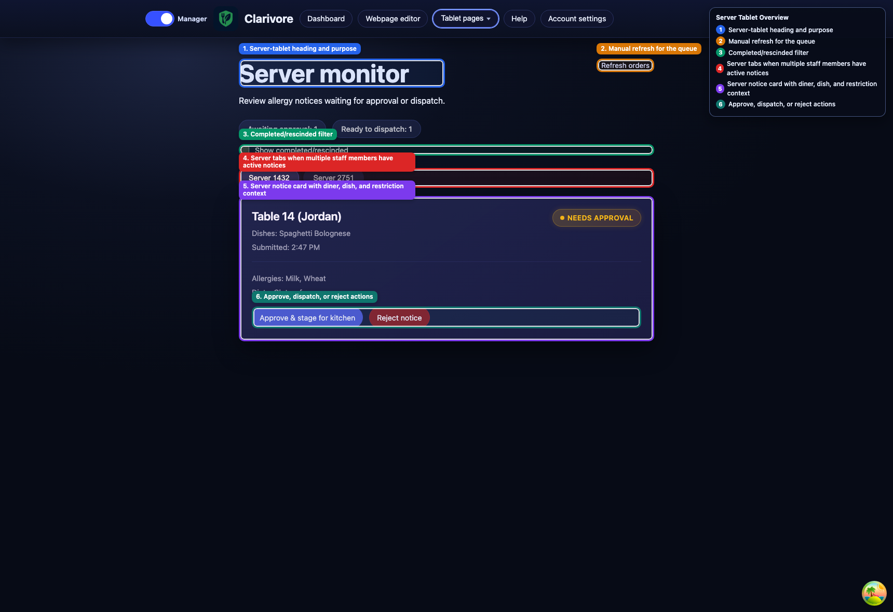

Callout mapping:

1. Server-tablet heading and purpose.
2. `Refresh orders`.
3. Completed/rescinded filter.
4. Server tabs for active staff queues.
5. Server notice card.
6. Approve, dispatch, or reject actions.

How to read a server card:

- Table and diner name
- Dishes in the notice
- Allergies and diets on the notice
- Status badge
- Action buttons appropriate to the status

Typical server actions:

- `Approve & stage for kitchen`
- `Send to kitchen`
- `Reject notice`

#### Step 2: Reject a notice when it cannot move forward

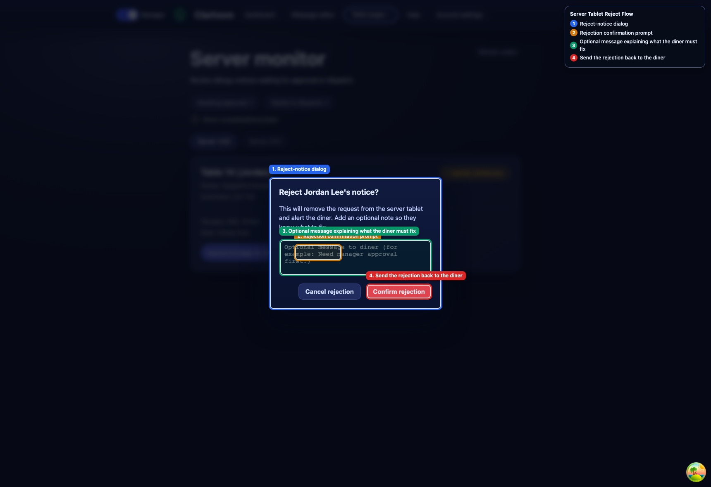

Callout mapping:

1. Reject-notice dialog.
2. Rejection prompt.
3. Optional diner-facing explanation.
4. Final rejection submit button.

Use rejection only when:

- The notice is invalid
- The diner must correct something before the notice can proceed
- Approval should not continue into kitchen handling

### Workflow 5B: Use The Kitchen Tablet

#### Step 1: Open the kitchen queue

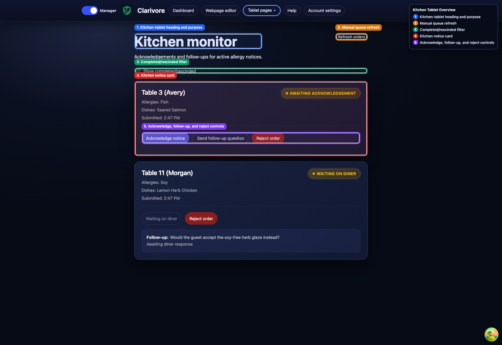

Callout mapping:

1. Kitchen-tablet heading and purpose.
2. `Refresh orders`.
3. Completed/rescinded filter.
4. Kitchen notice card.
5. Acknowledge, follow-up, and reject controls.

How to use this surface:

1. Review the current status badge.
2. Acknowledge the notice when the kitchen accepts it.
3. Send a follow-up question if the diner must answer something before the kitchen can proceed.
4. Reject the order only when the kitchen truly cannot complete it.

#### Step 2: Send a follow-up question

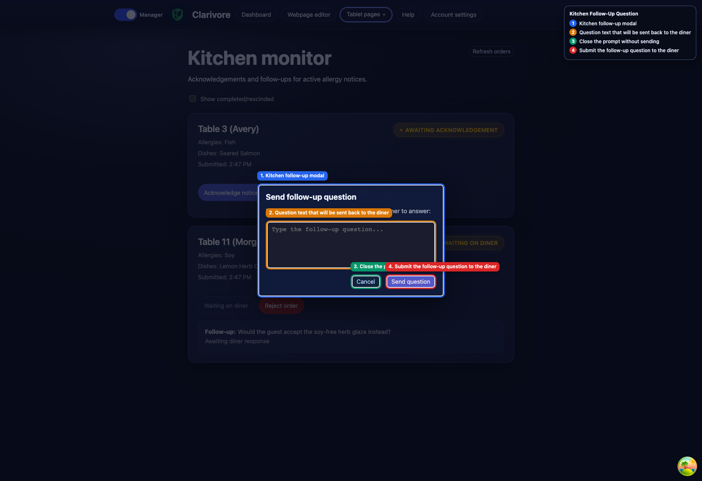

Callout mapping:

1. Kitchen follow-up modal.
2. Question text box.
3. `Cancel`.
4. `Send question`.

What good follow-up questions look like:

- Specific
- Actionable
- About one decision the diner can clearly answer

## Workflow 6: Use Help And Account Settings

### Workflow 6A: Use The Help Center In Manager Mode

#### Step 1: Review the help layout

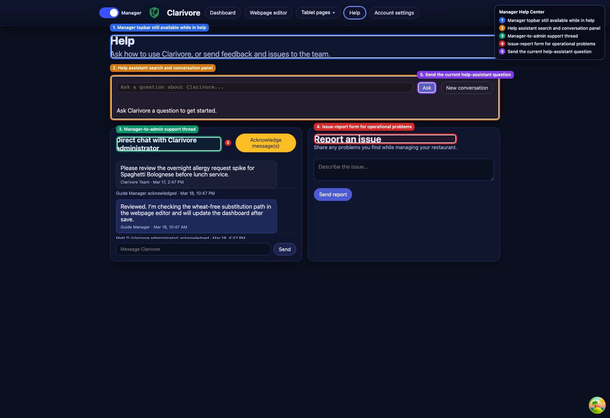

Callout mapping:

1. Manager topbar remains available.
2. Help assistant search and conversation panel.
3. Direct manager-to-admin support thread.
4. Issue-report form.
5. `Ask` for the help assistant.

Use the help page for:

- Clarivore usage questions
- Direct manager support chat
- Reporting product issues

### Workflow 6B: Use Account Settings

#### Step 1: Review your account controls

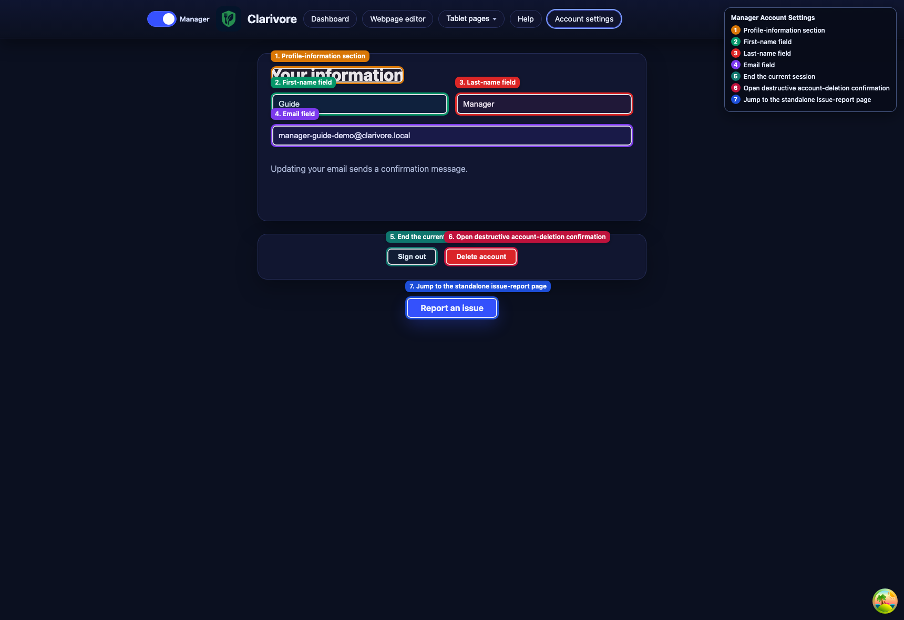

Callout mapping:

1. Manager navigation remains available inside account settings.
2. Profile-information section.
3. First-name field.
4. Last-name field.
5. Email field.
6. `Sign out`.
7. `Delete account`.
8. `Report an issue`.

Use this page for:

- Updating your personal information
- Signing out
- Starting account deletion
- Jumping into issue reporting

## Reference: What Each Major Status Means

### Accommodation request statuses

| Status | Meaning | Manager action |
| --- | --- | --- |
| `pending` | The request still needs a decision. | Review and choose a status. |
| `implemented` | The restaurant can now support the requested accommodation. | Confirm the editor and viewer really match this. |
| `reviewed` | The request has been evaluated but is not fully implemented. | Finish the follow-up work or keep monitoring. |
| `declined` | The accommodation cannot be supported. | Make sure the rationale is documented if needed. |

### Confirmation states

| State | Meaning | Manager action |
| --- | --- | --- |
| `Due in N days` | Confirmation window is approaching. | Schedule the confirmation flow. |
| `Due today` | Confirmation should be completed now. | Open the editor and complete both steps. |
| `X days overdue` | Confirmation is late. | Treat as highest priority. |

### Viewer legend

| Viewer status | Meaning |
| --- | --- |
| `Complies` | The dish fits the saved restriction set as-is. |
| `Can be modified` | The dish may fit if a removable or configurable item is changed. |
| `Cannot be modified` | The dish does not fit the restriction set. |

### Tablet status examples

| Surface | Status label | Meaning |
| --- | --- | --- |
| Server tablet | `Needs approval` | The notice has arrived and is waiting for server action. |
| Server tablet | `Ready to dispatch` or queued-for-kitchen equivalent | The server has staged it and can send it onward. |
| Kitchen tablet | `Awaiting acknowledgement` | The kitchen has received the notice and must acknowledge it. |
| Kitchen tablet | `Waiting on diner` | The kitchen asked a question and is waiting for a response. |

## Daily, Weekly, And Monthly Cadence

### Daily

1. Review unread direct messages.
2. Clear or update pending accommodation requests.
3. Check the confirmation due-state card.
4. Review analytics for new friction hotspots.
5. Monitor the server and kitchen tablet queues if active notices are in progress.

### Weekly

1. Review the changelog.
2. Audit brand items in use.
3. Validate a few high-traffic dishes in viewer mode.
4. Check request history for stale reviewed items that still need work.

### Monthly

1. Complete the full confirmation flow before the due date.
2. Re-check the highest-demand dishes with the worst compatibility or request patterns.
3. Resolve open manager-admin support threads related to menu accuracy.

## Troubleshooting And Escalation



### Symptom-to-action table

| Symptom | Likely cause | Immediate action |
| --- | --- | --- |
| Dashboard says sign-in is required | Session expired or never existed | Sign in again and return to `/manager-dashboard` |
| Dashboard loads but sections are missing | Data or access problem | Refresh once, then verify manager access |
| `Continue to brand items` is disabled | Current page photos or attestations are incomplete | Upload current page photos, answer both menu questions, wait for comparison to finish |
| Final confirmation cannot be submitted | Brand verification is incomplete | Replace or capture current brand evidence for every required card |
| `Save to site` is missing | No unsaved changes exist | Make the needed change first |
| Save is blocked | Ingredient confirmations are unresolved | Open the affected dish and confirm the row(s) |
| Viewer status looks wrong | Dish or ingredient data is incorrect | Return to the editor and correct the dish rows |
| Server or kitchen tablet shows the wrong dish info | Notice payload or order selection is wrong | Re-check the diner notice flow and tablet history |

### Escalation package

When you escalate to Clarivore, include:

1. Restaurant name
2. Full URL
3. Exact page you were on
4. Exact button you clicked
5. Exact text or badge you saw
6. Timestamp and timezone
7. Screenshot that clearly shows the state

## Rebuild Commands

- Seed the manager demo environment: `npm run docs:manager:setup`
- Regenerate workflow diagrams: `npm run docs:flows:build`
- Regenerate screenshots: `npm run docs:flows:capture`
- Lint the guide: `npm run docs:lint`
- Export the PDF: `npm run docs:manager:pdf`
